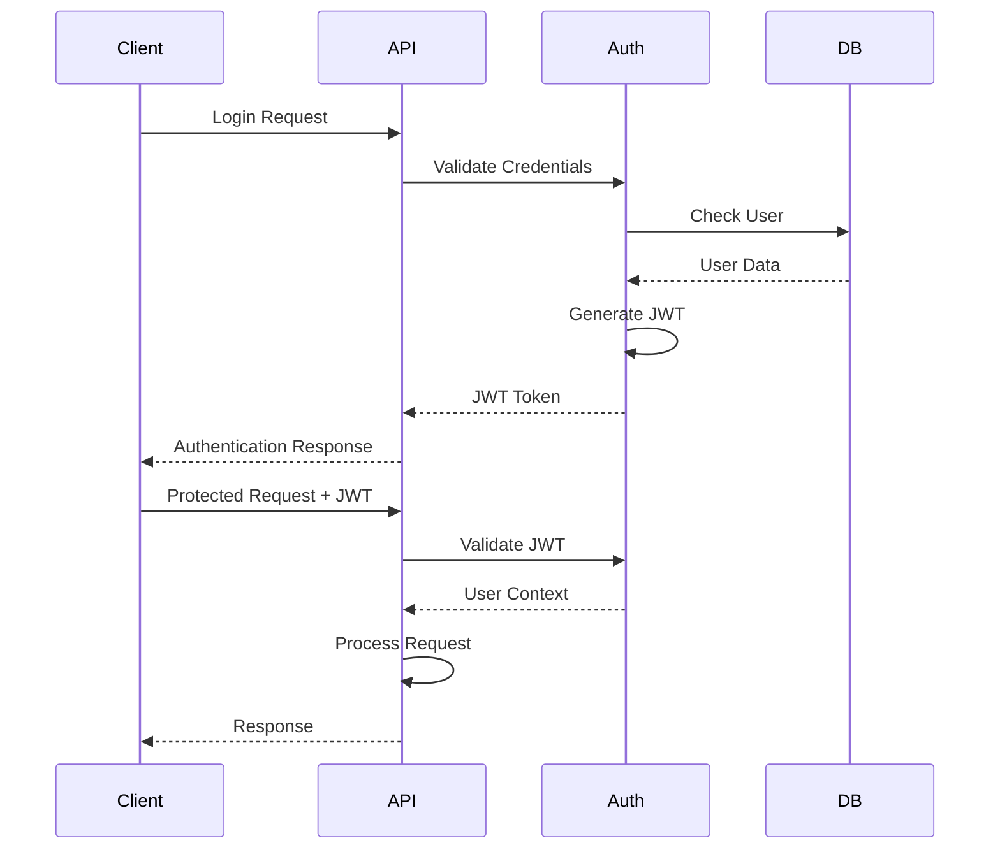

# Authentication Security Framework - DafnckMachine v3.1

## Overview
Comprehensive authentication and security framework for DafnckMachine v3.1, implementing robust user authentication, authorization, session management, and security best practices to protect user data and system integrity.

## Authentication Architecture

### Multi-Layer Security Approach
1. **Authentication Layer**: User identity verification
2. **Authorization Layer**: Permission and access control
3. **Session Management**: Secure session handling
4. **Data Protection**: Encryption and data security
5. **Audit Layer**: Security monitoring and logging

### Authentication Flow


## JWT Token Implementation

### Token Structure
```javascript
// JWT Payload Structure
const tokenPayload = {
  // Standard claims
  iss: 'dafnckmachine.com',           // Issuer
  sub: 'user_123',                    // Subject (User ID)
  aud: 'dafnckmachine-api',           // Audience
  exp: Math.floor(Date.now() / 1000) + (60 * 60), // Expiration (1 hour)
  iat: Math.floor(Date.now() / 1000), // Issued at
  jti: 'unique-token-id',             // JWT ID
  
  // Custom claims
  email: 'user@example.com',
  role: 'user',
  permissions: ['read:projects', 'write:projects'],
  sessionId: 'session_456'
};
```

### Token Generation
```javascript
// lib/auth/jwt.js
const jwt = require('jsonwebtoken');
const crypto = require('crypto');

class JWTService {
  constructor() {
    this.accessTokenSecret = process.env.JWT_ACCESS_SECRET;
    this.refreshTokenSecret = process.env.JWT_REFRESH_SECRET;
    this.accessTokenExpiry = '15m';
    this.refreshTokenExpiry = '7d';
  }

  generateTokenPair(user) {
    const payload = {
      sub: user.id,
      email: user.email,
      role: user.role,
      permissions: this.getUserPermissions(user.role),
      sessionId: crypto.randomUUID()
    };

    const accessToken = jwt.sign(payload, this.accessTokenSecret, {
      expiresIn: this.accessTokenExpiry,
      issuer: 'dafnckmachine.com',
      audience: 'dafnckmachine-api'
    });

    const refreshToken = jwt.sign(
      { sub: user.id, sessionId: payload.sessionId },
      this.refreshTokenSecret,
      {
        expiresIn: this.refreshTokenExpiry,
        issuer: 'dafnckmachine.com',
        audience: 'dafnckmachine-api'
      }
    );

    return { accessToken, refreshToken, expiresIn: 900 }; // 15 minutes
  }

  verifyAccessToken(token) {
    try {
      return jwt.verify(token, this.accessTokenSecret, {
        issuer: 'dafnckmachine.com',
        audience: 'dafnckmachine-api'
      });
    } catch (error) {
      throw new Error('Invalid access token');
    }
  }

  verifyRefreshToken(token) {
    try {
      return jwt.verify(token, this.refreshTokenSecret, {
        issuer: 'dafnckmachine.com',
        audience: 'dafnckmachine-api'
      });
    } catch (error) {
      throw new Error('Invalid refresh token');
    }
  }

  getUserPermissions(role) {
    const permissions = {
      admin: [
        'read:*', 'write:*', 'delete:*',
        'manage:users', 'manage:system'
      ],
      moderator: [
        'read:*', 'write:projects', 'write:tasks',
        'moderate:content'
      ],
      user: [
        'read:own', 'write:own',
        'read:projects', 'write:projects',
        'read:tasks', 'write:tasks'
      ]
    };
    return permissions[role] || permissions.user;
  }
}

module.exports = new JWTService();
```

## Password Security

### Password Hashing with Argon2
```javascript
// lib/auth/password.js
const argon2 = require('argon2');

class PasswordService {
  constructor() {
    this.hashingOptions = {
      type: argon2.argon2id,
      memoryCost: 2 ** 16, // 64 MB
      timeCost: 3,         // 3 iterations
      parallelism: 1,      // 1 thread
    };
  }

  async hashPassword(password) {
    try {
      // Validate password strength
      this.validatePasswordStrength(password);
      
      return await argon2.hash(password, this.hashingOptions);
    } catch (error) {
      throw new Error(`Password hashing failed: ${error.message}`);
    }
  }

  async verifyPassword(password, hash) {
    try {
      return await argon2.verify(hash, password);
    } catch (error) {
      throw new Error('Password verification failed');
    }
  }

  validatePasswordStrength(password) {
    const minLength = 8;
    const hasUpperCase = /[A-Z]/.test(password);
    const hasLowerCase = /[a-z]/.test(password);
    const hasNumbers = /\d/.test(password);
    const hasSpecialChar = /[!@#$%^&*(),.?":{}|<>]/.test(password);

    if (password.length < minLength) {
      throw new Error('Password must be at least 8 characters long');
    }

    if (!hasUpperCase || !hasLowerCase || !hasNumbers || !hasSpecialChar) {
      throw new Error(
        'Password must contain uppercase, lowercase, numbers, and special characters'
      );
    }

    // Check against common passwords
    if (this.isCommonPassword(password)) {
      throw new Error('Password is too common. Please choose a stronger password');
    }
  }

  isCommonPassword(password) {
    const commonPasswords = [
      'password', '123456', 'password123', 'admin', 'qwerty',
      'letmein', 'welcome', 'monkey', '1234567890'
    ];
    return commonPasswords.includes(password.toLowerCase());
  }
}

module.exports = new PasswordService();
```

## Multi-Factor Authentication (MFA)

### TOTP Implementation
```javascript
// lib/auth/mfa.js
const speakeasy = require('speakeasy');
const QRCode = require('qrcode');

class MFAService {
  generateSecret(userEmail) {
    const secret = speakeasy.generateSecret({
      name: `DafnckMachine (${userEmail})`,
      issuer: 'DafnckMachine',
      length: 32
    });

    return {
      secret: secret.base32,
      qrCodeUrl: secret.otpauth_url
    };
  }

  async generateQRCode(otpauthUrl) {
    try {
      return await QRCode.toDataURL(otpauthUrl);
    } catch (error) {
      throw new Error('Failed to generate QR code');
    }
  }

  verifyToken(token, secret) {
    return speakeasy.totp.verify({
      secret,
      encoding: 'base32',
      token,
      window: 2 // Allow 2 time steps (60 seconds) tolerance
    });
  }

  generateBackupCodes() {
    const codes = [];
    for (let i = 0; i < 10; i++) {
      codes.push(this.generateBackupCode());
    }
    return codes;
  }

  generateBackupCode() {
    const chars = 'ABCDEFGHIJKLMNOPQRSTUVWXYZ0123456789';
    let code = '';
    for (let i = 0; i < 8; i++) {
      code += chars.charAt(Math.floor(Math.random() * chars.length));
    }
    return code;
  }
}

module.exports = new MFAService();
```

## Session Management

### Secure Session Handling
```javascript
// lib/auth/session.js
const Redis = require('ioredis');
const crypto = require('crypto');

class SessionService {
  constructor() {
    this.redis = new Redis({
      host: process.env.REDIS_HOST,
      port: process.env.REDIS_PORT,
      password: process.env.REDIS_PASSWORD,
    });
    this.sessionTTL = 7 * 24 * 60 * 60; // 7 days
  }

  async createSession(userId, deviceInfo = {}) {
    const sessionId = crypto.randomUUID();
    const sessionData = {
      userId,
      createdAt: new Date().toISOString(),
      lastActivity: new Date().toISOString(),
      deviceInfo: {
        userAgent: deviceInfo.userAgent,
        ip: deviceInfo.ip,
        platform: deviceInfo.platform
      },
      isActive: true
    };

    await this.redis.setex(
      `session:${sessionId}`,
      this.sessionTTL,
      JSON.stringify(sessionData)
    );

    // Track user sessions
    await this.redis.sadd(`user:${userId}:sessions`, sessionId);
    await this.redis.expire(`user:${userId}:sessions`, this.sessionTTL);

    return sessionId;
  }

  async getSession(sessionId) {
    const sessionData = await this.redis.get(`session:${sessionId}`);
    return sessionData ? JSON.parse(sessionData) : null;
  }

  async updateSessionActivity(sessionId) {
    const session = await this.getSession(sessionId);
    if (session) {
      session.lastActivity = new Date().toISOString();
      await this.redis.setex(
        `session:${sessionId}`,
        this.sessionTTL,
        JSON.stringify(session)
      );
    }
  }

  async revokeSession(sessionId) {
    const session = await this.getSession(sessionId);
    if (session) {
      await this.redis.del(`session:${sessionId}`);
      await this.redis.srem(`user:${session.userId}:sessions`, sessionId);
    }
  }

  async revokeAllUserSessions(userId) {
    const sessions = await this.redis.smembers(`user:${userId}:sessions`);
    if (sessions.length > 0) {
      const pipeline = this.redis.pipeline();
      sessions.forEach(sessionId => {
        pipeline.del(`session:${sessionId}`);
      });
      pipeline.del(`user:${userId}:sessions`);
      await pipeline.exec();
    }
  }

  async getUserActiveSessions(userId) {
    const sessionIds = await this.redis.smembers(`user:${userId}:sessions`);
    const sessions = [];
    
    for (const sessionId of sessionIds) {
      const session = await this.getSession(sessionId);
      if (session) {
        sessions.push({ id: sessionId, ...session });
      }
    }
    
    return sessions;
  }
}

module.exports = new SessionService();
```

## Authorization & Access Control

### Role-Based Access Control (RBAC)
```javascript
// lib/auth/authorization.js
class AuthorizationService {
  constructor() {
    this.roleHierarchy = {
      admin: ['moderator', 'user'],
      moderator: ['user'],
      user: []
    };
  }

  hasPermission(userRole, userPermissions, requiredPermission) {
    // Check direct permission
    if (userPermissions.includes(requiredPermission)) {
      return true;
    }

    // Check wildcard permissions
    const [resource, action] = requiredPermission.split(':');
    const wildcardPermissions = [
      `${resource}:*`,
      `*:${action}`,
      '*:*'
    ];

    return wildcardPermissions.some(perm => userPermissions.includes(perm));
  }

  hasRole(userRole, requiredRole) {
    if (userRole === requiredRole) {
      return true;
    }

    // Check role hierarchy
    const inheritedRoles = this.roleHierarchy[userRole] || [];
    return inheritedRoles.includes(requiredRole);
  }

  canAccessResource(user, resource, action, resourceOwnerId = null) {
    const permission = `${action}:${resource}`;
    
    // Check if user has direct permission
    if (this.hasPermission(user.role, user.permissions, permission)) {
      return true;
    }

    // Check ownership for 'own' resources
    if (resourceOwnerId && user.id === resourceOwnerId) {
      const ownPermission = `${action}:own`;
      return this.hasPermission(user.role, user.permissions, ownPermission);
    }

    return false;
  }
}

module.exports = new AuthorizationService();
```

### Middleware Implementation
```javascript
// middleware/auth.js
const JWTService = require('../lib/auth/jwt');
const SessionService = require('../lib/auth/session');
const AuthorizationService = require('../lib/auth/authorization');

const authenticate = async (req, res, next) => {
  try {
    const authHeader = req.headers.authorization;
    if (!authHeader || !authHeader.startsWith('Bearer ')) {
      return res.status(401).json({
        success: false,
        error: { code: 'MISSING_TOKEN', message: 'Authentication token required' }
      });
    }

    const token = authHeader.substring(7);
    const decoded = JWTService.verifyAccessToken(token);

    // Verify session is still active
    const session = await SessionService.getSession(decoded.sessionId);
    if (!session || !session.isActive) {
      return res.status(401).json({
        success: false,
        error: { code: 'INVALID_SESSION', message: 'Session expired or invalid' }
      });
    }

    // Update session activity
    await SessionService.updateSessionActivity(decoded.sessionId);

    req.user = decoded;
    req.sessionId = decoded.sessionId;
    next();
  } catch (error) {
    return res.status(401).json({
      success: false,
      error: { code: 'INVALID_TOKEN', message: 'Invalid authentication token' }
    });
  }
};

const authorize = (requiredPermission) => {
  return (req, res, next) => {
    if (!req.user) {
      return res.status(401).json({
        success: false,
        error: { code: 'UNAUTHENTICATED', message: 'Authentication required' }
      });
    }

    const hasPermission = AuthorizationService.hasPermission(
      req.user.role,
      req.user.permissions,
      requiredPermission
    );

    if (!hasPermission) {
      return res.status(403).json({
        success: false,
        error: { code: 'INSUFFICIENT_PERMISSIONS', message: 'Access denied' }
      });
    }

    next();
  };
};

const requireRole = (requiredRole) => {
  return (req, res, next) => {
    if (!req.user) {
      return res.status(401).json({
        success: false,
        error: { code: 'UNAUTHENTICATED', message: 'Authentication required' }
      });
    }

    const hasRole = AuthorizationService.hasRole(req.user.role, requiredRole);

    if (!hasRole) {
      return res.status(403).json({
        success: false,
        error: { code: 'INSUFFICIENT_ROLE', message: 'Access denied' }
      });
    }

    next();
  };
};

module.exports = { authenticate, authorize, requireRole };
```

## Security Headers & CORS

### Security Headers Configuration
```javascript
// middleware/security.js
const helmet = require('helmet');
const rateLimit = require('express-rate-limit');

const securityHeaders = helmet({
  contentSecurityPolicy: {
    directives: {
      defaultSrc: ["'self'"],
      styleSrc: ["'self'", "'unsafe-inline'", "https://fonts.googleapis.com"],
      fontSrc: ["'self'", "https://fonts.gstatic.com"],
      imgSrc: ["'self'", "data:", "https:"],
      scriptSrc: ["'self'"],
      connectSrc: ["'self'", "https://api.dafnckmachine.com"],
      frameSrc: ["'none'"],
      objectSrc: ["'none'"],
      baseUri: ["'self'"],
      formAction: ["'self'"],
      upgradeInsecureRequests: [],
    },
  },
  hsts: {
    maxAge: 31536000,
    includeSubDomains: true,
    preload: true
  },
  noSniff: true,
  frameguard: { action: 'deny' },
  xssFilter: true,
  referrerPolicy: { policy: 'strict-origin-when-cross-origin' }
});

const rateLimiter = rateLimit({
  windowMs: 15 * 60 * 1000, // 15 minutes
  max: 100, // Limit each IP to 100 requests per windowMs
  message: {
    success: false,
    error: {
      code: 'RATE_LIMIT_EXCEEDED',
      message: 'Too many requests, please try again later'
    }
  },
  standardHeaders: true,
  legacyHeaders: false,
});

const authRateLimiter = rateLimit({
  windowMs: 15 * 60 * 1000, // 15 minutes
  max: 5, // Limit each IP to 5 auth requests per windowMs
  skipSuccessfulRequests: true,
  message: {
    success: false,
    error: {
      code: 'AUTH_RATE_LIMIT_EXCEEDED',
      message: 'Too many authentication attempts, please try again later'
    }
  }
});

module.exports = { securityHeaders, rateLimiter, authRateLimiter };
```

### CORS Configuration
```javascript
// middleware/cors.js
const cors = require('cors');

const corsOptions = {
  origin: function (origin, callback) {
    const allowedOrigins = [
      'https://dafnckmachine.com',
      'https://app.dafnckmachine.com',
      'https://admin.dafnckmachine.com'
    ];

    // Allow requests with no origin (mobile apps, etc.)
    if (!origin) return callback(null, true);

    if (allowedOrigins.includes(origin)) {
      callback(null, true);
    } else {
      callback(new Error('Not allowed by CORS'));
    }
  },
  credentials: true,
  methods: ['GET', 'POST', 'PUT', 'DELETE', 'OPTIONS'],
  allowedHeaders: [
    'Origin',
    'X-Requested-With',
    'Content-Type',
    'Accept',
    'Authorization',
    'X-API-Key'
  ],
  exposedHeaders: [
    'X-RateLimit-Limit',
    'X-RateLimit-Remaining',
    'X-RateLimit-Reset'
  ],
  maxAge: 86400 // 24 hours
};

module.exports = cors(corsOptions);
```

## Input Validation & Sanitization

### Request Validation
```javascript
// lib/validation/schemas.js
const Joi = require('joi');

const authSchemas = {
  login: Joi.object({
    email: Joi.string().email().required(),
    password: Joi.string().min(8).required(),
    rememberMe: Joi.boolean().default(false)
  }),

  register: Joi.object({
    email: Joi.string().email().required(),
    password: Joi.string().min(8).pattern(
      /^(?=.*[a-z])(?=.*[A-Z])(?=.*\d)(?=.*[@$!%*?&])[A-Za-z\d@$!%*?&]/
    ).required(),
    firstName: Joi.string().min(2).max(50).required(),
    lastName: Joi.string().min(2).max(50).required(),
    terms: Joi.boolean().valid(true).required()
  }),

  changePassword: Joi.object({
    currentPassword: Joi.string().required(),
    newPassword: Joi.string().min(8).pattern(
      /^(?=.*[a-z])(?=.*[A-Z])(?=.*\d)(?=.*[@$!%*?&])[A-Za-z\d@$!%*?&]/
    ).required(),
    confirmPassword: Joi.string().valid(Joi.ref('newPassword')).required()
  }),

  mfaSetup: Joi.object({
    token: Joi.string().length(6).pattern(/^\d+$/).required()
  })
};

module.exports = { authSchemas };
```

### Validation Middleware
```javascript
// middleware/validation.js
const { authSchemas } = require('../lib/validation/schemas');

const validate = (schema) => {
  return (req, res, next) => {
    const { error, value } = schema.validate(req.body, {
      abortEarly: false,
      stripUnknown: true
    });

    if (error) {
      const errors = error.details.map(detail => ({
        field: detail.path.join('.'),
        message: detail.message
      }));

      return res.status(400).json({
        success: false,
        error: {
          code: 'VALIDATION_ERROR',
          message: 'Invalid input data',
          details: errors
        }
      });
    }

    req.body = value;
    next();
  };
};

module.exports = { validate, authSchemas };
```

## Audit Logging & Security Monitoring

### Security Event Logging
```javascript
// lib/audit/logger.js
const winston = require('winston');

class SecurityLogger {
  constructor() {
    this.logger = winston.createLogger({
      level: 'info',
      format: winston.format.combine(
        winston.format.timestamp(),
        winston.format.errors({ stack: true }),
        winston.format.json()
      ),
      defaultMeta: { service: 'dafnckmachine-auth' },
      transports: [
        new winston.transports.File({ 
          filename: 'logs/security-error.log', 
          level: 'error' 
        }),
        new winston.transports.File({ 
          filename: 'logs/security-audit.log' 
        })
      ]
    });
  }

  logAuthEvent(event, userId, details = {}) {
    this.logger.info({
      event,
      userId,
      timestamp: new Date().toISOString(),
      ip: details.ip,
      userAgent: details.userAgent,
      success: details.success,
      reason: details.reason
    });
  }

  logSecurityEvent(event, severity, details = {}) {
    this.logger.log(severity, {
      event,
      timestamp: new Date().toISOString(),
      ...details
    });
  }

  logFailedLogin(email, ip, userAgent, reason) {
    this.logAuthEvent('LOGIN_FAILED', null, {
      email,
      ip,
      userAgent,
      success: false,
      reason
    });
  }

  logSuccessfulLogin(userId, ip, userAgent) {
    this.logAuthEvent('LOGIN_SUCCESS', userId, {
      ip,
      userAgent,
      success: true
    });
  }

  logPasswordChange(userId, ip) {
    this.logAuthEvent('PASSWORD_CHANGED', userId, {
      ip,
      success: true
    });
  }

  logMFAEvent(userId, event, success, ip) {
    this.logAuthEvent(`MFA_${event}`, userId, {
      ip,
      success
    });
  }
}

module.exports = new SecurityLogger();
```

## Security Best Practices

### Implementation Checklist
- ✅ **Password Security**: Argon2 hashing with proper parameters
- ✅ **JWT Security**: Short-lived access tokens with refresh tokens
- ✅ **Session Management**: Secure session storage with Redis
- ✅ **Multi-Factor Authentication**: TOTP implementation with backup codes
- ✅ **Rate Limiting**: API and authentication rate limiting
- ✅ **Input Validation**: Comprehensive request validation
- ✅ **Security Headers**: Helmet.js with CSP and HSTS
- ✅ **CORS Configuration**: Strict origin validation
- ✅ **Audit Logging**: Comprehensive security event logging
- ✅ **Authorization**: Role-based access control with permissions

### Security Configuration
```javascript
// config/security.js
module.exports = {
  jwt: {
    accessTokenExpiry: '15m',
    refreshTokenExpiry: '7d',
    issuer: 'dafnckmachine.com',
    audience: 'dafnckmachine-api'
  },
  
  password: {
    minLength: 8,
    requireUppercase: true,
    requireLowercase: true,
    requireNumbers: true,
    requireSpecialChars: true,
    maxAttempts: 5,
    lockoutDuration: 15 * 60 * 1000 // 15 minutes
  },
  
  session: {
    ttl: 7 * 24 * 60 * 60, // 7 days
    maxConcurrentSessions: 5
  },
  
  rateLimit: {
    general: { windowMs: 15 * 60 * 1000, max: 100 },
    auth: { windowMs: 15 * 60 * 1000, max: 5 },
    passwordReset: { windowMs: 60 * 60 * 1000, max: 3 }
  },
  
  mfa: {
    window: 2, // 60 seconds tolerance
    backupCodesCount: 10
  }
};
```

This authentication security framework provides comprehensive protection for DafnckMachine v3.1, implementing industry best practices for user authentication, authorization, and security monitoring. 