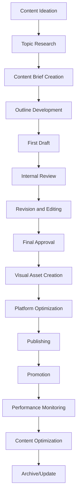

# Content Creation Guidelines

## Overview
This document provides comprehensive guidelines for creating high-quality, engaging content for DafnckMachine v3.1 across all marketing channels. It covers content strategy, creation processes, brand voice, visual standards, and quality assurance protocols.

## Brand Voice and Messaging

### Brand Personality Framework
```yaml
# Brand Voice Configuration
brand_voice:
  core_attributes:
    professional:
      description: "Knowledgeable and credible in technical matters"
      tone_indicators:
        - Use industry-standard terminology correctly
        - Provide accurate technical information
        - Reference authoritative sources
        - Maintain expertise positioning
    
    approachable:
      description: "Friendly and accessible to all skill levels"
      tone_indicators:
        - Use conversational language
        - Avoid unnecessary jargon
        - Include helpful explanations
        - Show empathy for user challenges
    
    innovative:
      description: "Forward-thinking and cutting-edge"
      tone_indicators:
        - Highlight latest technologies
        - Discuss future trends
        - Showcase creative solutions
        - Emphasize continuous improvement
    
    helpful:
      description: "Solution-oriented and supportive"
      tone_indicators:
        - Provide actionable advice
        - Offer step-by-step guidance
        - Address common pain points
        - Focus on user success

  communication_style:
    sentence_structure:
      - Use active voice when possible
      - Keep sentences concise and clear
      - Vary sentence length for readability
      - Use parallel structure in lists
    
    vocabulary:
      - Technical terms with explanations
      - Industry-specific language when appropriate
      - Avoid overly complex words
      - Use inclusive language
    
    formatting:
      - Use headers for organization
      - Include bullet points for clarity
      - Add code examples when relevant
      - Incorporate visual elements
```

### Messaging Hierarchy
```json
{
  "messaging_framework": {
    "primary_value_proposition": {
      "statement": "DafnckMachine simplifies complex automation workflows, enabling teams to focus on innovation rather than repetitive tasks.",
      "supporting_points": [
        "Reduce manual work by up to 80%",
        "Integrate with existing tools seamlessly",
        "Scale automation across your organization",
        "Improve reliability and consistency"
      ]
    },
    
    "secondary_messages": {
      "ease_of_use": {
        "statement": "Powerful automation made simple",
        "context": "For users concerned about complexity"
      },
      "reliability": {
        "statement": "Enterprise-grade reliability you can trust",
        "context": "For enterprise decision makers"
      },
      "flexibility": {
        "statement": "Adapt to your unique workflow needs",
        "context": "For teams with specific requirements"
      },
      "community": {
        "statement": "Join thousands of teams automating smarter",
        "context": "For social proof and community building"
      }
    },
    
    "proof_points": {
      "performance": [
        "99.9% uptime guarantee",
        "Sub-second response times",
        "Handles 10M+ operations daily"
      ],
      "adoption": [
        "Used by 500+ companies",
        "95% customer satisfaction",
        "40% faster deployment times"
      ],
      "security": [
        "SOC 2 Type II certified",
        "End-to-end encryption",
        "GDPR compliant"
      ]
    }
  }
}
```

## Content Strategy Framework

### Content Pillars and Themes
```yaml
# Content Strategy Configuration
content_strategy:
  pillar_1_education:
    objective: "Educate audience on automation best practices"
    content_types:
      - How-to guides and tutorials
      - Best practice articles
      - Technical deep-dives
      - Troubleshooting guides
    
    target_audience:
      - Developers and engineers
      - DevOps practitioners
      - Technical decision makers
    
    success_metrics:
      - Time on page
      - Content downloads
      - Tutorial completion rates
      - Knowledge base usage

  pillar_2_inspiration:
    objective: "Inspire with success stories and possibilities"
    content_types:
      - Customer case studies
      - Success story videos
      - ROI calculators
      - Industry trend analysis
    
    target_audience:
      - Business decision makers
      - Team leaders
      - C-level executives
    
    success_metrics:
      - Social shares
      - Demo requests
      - Sales qualified leads
      - Brand sentiment

  pillar_3_community:
    objective: "Build and nurture user community"
    content_types:
      - User-generated content
      - Community highlights
      - Expert interviews
      - Behind-the-scenes content
    
    target_audience:
      - Existing customers
      - Community members
      - Industry influencers
    
    success_metrics:
      - Community engagement
      - User-generated content
      - Referral rates
      - Customer advocacy

  pillar_4_innovation:
    objective: "Showcase product innovation and roadmap"
    content_types:
      - Feature announcements
      - Product roadmap updates
      - Technology previews
      - Innovation stories
    
    target_audience:
      - Current users
      - Prospects evaluating solutions
      - Technology enthusiasts
    
    success_metrics:
      - Feature adoption
      - Product feedback
      - Trial conversions
      - Upgrade rates
```

### Content Calendar Structure
```markdown
# Editorial Calendar Framework

## Monthly Themes
- **January**: New Year, New Automations
- **February**: Love Your Workflow
- **March**: Spring Cleaning Your Tech Stack
- **April**: Growth and Scaling
- **May**: Mental Health and Work-Life Balance
- **June**: Summer of Innovation
- **July**: Independence from Manual Tasks
- **August**: Back-to-School Learning
- **September**: Harvest Your Automation ROI
- **October**: Spooky Manual Processes
- **November**: Gratitude and Giving Back
- **December**: Year in Review and Planning

## Weekly Content Structure
### Monday - Motivation Monday
- Inspirational success stories
- Week ahead previews
- Goal-setting content
- Motivational quotes with automation twist

### Tuesday - Tutorial Tuesday
- Step-by-step guides
- Video tutorials
- Technical how-tos
- Best practice walkthroughs

### Wednesday - Wisdom Wednesday
- Industry insights
- Expert opinions
- Thought leadership pieces
- Trend analysis

### Thursday - Throwback Thursday
- Evolution of automation
- Historical perspectives
- Progress showcases
- Before/after comparisons

### Friday - Feature Friday
- Product feature highlights
- New release announcements
- Feature deep-dives
- User tips and tricks
```

## Content Creation Process

### Content Development Workflow


### Content Brief Template
```yaml
# Content Brief Template
content_brief:
  project_details:
    title: "[Working Title]"
    content_type: "[Blog post/Video/Infographic/etc.]"
    target_audience: "[Primary audience segment]"
    content_pillar: "[Education/Inspiration/Community/Innovation]"
    publication_date: "[YYYY-MM-DD]"
    
  objectives:
    primary_goal: "[Main objective of the content]"
    secondary_goals:
      - "[Supporting objective 1]"
      - "[Supporting objective 2]"
    
    success_metrics:
      - "[Metric 1 with target]"
      - "[Metric 2 with target]"
  
  content_requirements:
    key_messages:
      - "[Primary message]"
      - "[Supporting message 1]"
      - "[Supporting message 2]"
    
    must_include:
      - "[Required element 1]"
      - "[Required element 2]"
    
    tone_and_style:
      - "[Tone descriptor]"
      - "[Style requirement]"
  
  technical_specifications:
    word_count: "[Target word count]"
    format_requirements:
      - "[Format requirement 1]"
      - "[Format requirement 2]"
    
    seo_requirements:
      primary_keyword: "[Main keyword]"
      secondary_keywords:
        - "[Keyword 1]"
        - "[Keyword 2]"
  
  resources_and_references:
    research_sources:
      - "[Source 1]"
      - "[Source 2]"
    
    internal_resources:
      - "[Internal document/expert]"
      - "[Product information]"
```

### Quality Assurance Checklist
```markdown
# Content QA Checklist

## Content Quality
- [ ] Aligns with brand voice and messaging
- [ ] Provides clear value to target audience
- [ ] Includes actionable insights or information
- [ ] Maintains consistent tone throughout
- [ ] Uses appropriate technical level for audience

## Technical Accuracy
- [ ] All technical information verified
- [ ] Code examples tested and functional
- [ ] Links and references checked
- [ ] Product information up-to-date
- [ ] Screenshots and visuals current

## SEO Optimization
- [ ] Primary keyword included in title
- [ ] Meta description optimized
- [ ] Headers use target keywords naturally
- [ ] Internal and external links included
- [ ] Alt text added to all images

## Brand Compliance
- [ ] Visual elements follow brand guidelines
- [ ] Logo usage correct
- [ ] Color palette consistent
- [ ] Typography standards maintained
- [ ] Legal disclaimers included where needed

## Accessibility
- [ ] Alt text for all images
- [ ] Proper heading structure (H1, H2, H3)
- [ ] Sufficient color contrast
- [ ] Readable font sizes
- [ ] Video captions where applicable

## Platform Optimization
- [ ] Content formatted for target platform
- [ ] Character limits respected
- [ ] Hashtags appropriate and researched
- [ ] Call-to-action clear and compelling
- [ ] Publishing schedule optimized
```

## Visual Content Standards

### Brand Visual Guidelines
```yaml
# Visual Brand Standards
visual_standards:
  color_palette:
    primary_colors:
      brand_blue: "#1E40AF"
      brand_green: "#10B981"
      brand_orange: "#F59E0B"
    
    secondary_colors:
      light_blue: "#3B82F6"
      light_green: "#34D399"
      light_orange: "#FBBF24"
    
    neutral_colors:
      dark_gray: "#374151"
      medium_gray: "#6B7280"
      light_gray: "#D1D5DB"
      white: "#FFFFFF"

  typography:
    primary_font:
      name: "Inter"
      weights: [400, 500, 600, 700]
      usage: "Headers, body text, UI elements"
    
    secondary_font:
      name: "JetBrains Mono"
      weights: [400, 500, 600]
      usage: "Code snippets, technical content"
    
    font_sizes:
      h1: "2.5rem (40px)"
      h2: "2rem (32px)"
      h3: "1.5rem (24px)"
      h4: "1.25rem (20px)"
      body: "1rem (16px)"
      small: "0.875rem (14px)"

  logo_usage:
    primary_logo:
      file_formats: ["SVG", "PNG", "PDF"]
      minimum_size: "120px width"
      clear_space: "Equal to logo height"
    
    variations:
      - Full color on light backgrounds
      - White on dark backgrounds
      - Single color (blue) for limited color applications
      - Icon only for small applications

  imagery_style:
    photography:
      style: "Clean, modern, professional"
      subjects: "Real people, authentic moments"
      lighting: "Natural, well-lit"
      composition: "Balanced, purposeful"
    
    illustrations:
      style: "Geometric, modern, minimal"
      color_usage: "Brand palette with selective accent colors"
      complexity: "Simple, clear, purposeful"
      consistency: "Unified style across all materials"
```

### Content Template Library
```json
{
  "template_library": {
    "social_media_templates": {
      "quote_card": {
        "dimensions": "1080x1080px",
        "elements": [
          "Background with brand gradient",
          "Quote text in primary font",
          "Attribution line",
          "Logo placement",
          "Branded border or frame"
        ]
      },
      
      "tip_graphic": {
        "dimensions": "1080x1080px",
        "elements": [
          "Icon or illustration",
          "Tip headline",
          "Bullet points or steps",
          "Call-to-action",
          "Brand elements"
        ]
      },
      
      "announcement_post": {
        "dimensions": "1080x1080px",
        "elements": [
          "Product screenshot or mockup",
          "Announcement headline",
          "Key benefits or features",
          "Release date or availability",
          "Logo and branding"
        ]
      }
    },
    
    "blog_templates": {
      "tutorial_post": {
        "structure": [
          "Introduction and overview",
          "Prerequisites",
          "Step-by-step instructions",
          "Code examples",
          "Troubleshooting tips",
          "Conclusion and next steps"
        ]
      },
      
      "case_study": {
        "structure": [
          "Customer background",
          "Challenge description",
          "Solution implementation",
          "Results and metrics",
          "Key takeaways",
          "Call-to-action"
        ]
      }
    },
    
    "video_templates": {
      "product_demo": {
        "structure": [
          "Hook and introduction (0-15s)",
          "Problem statement (15-30s)",
          "Solution demonstration (30s-2m)",
          "Key benefits (2m-2m30s)",
          "Call-to-action (2m30s-3m)"
        ]
      }
    }
  }
}
```

## Content Optimization and SEO

### SEO Content Guidelines
```yaml
# SEO Optimization Framework
seo_guidelines:
  keyword_research:
    primary_keywords:
      - "DevOps automation"
      - "CI/CD pipeline"
      - "Workflow automation"
      - "Business process automation"
      - "Deployment automation"
    
    long_tail_keywords:
      - "How to automate DevOps pipeline"
      - "Best automation tools for developers"
      - "CI/CD automation best practices"
      - "Automated testing workflows"
      - "Infrastructure automation guide"
    
    keyword_placement:
      title_tag: "Include primary keyword naturally"
      meta_description: "Include primary and one secondary keyword"
      h1_tag: "Primary keyword in main heading"
      h2_h3_tags: "Secondary keywords in subheadings"
      body_content: "Natural keyword distribution (1-2% density)"
      image_alt_text: "Descriptive text with relevant keywords"

  content_structure:
    title_optimization:
      - Keep under 60 characters
      - Include primary keyword
      - Make compelling and clickable
      - Use numbers when appropriate
      - Include brand name when relevant
    
    meta_description:
      - Keep under 160 characters
      - Include primary keyword
      - Write compelling copy
      - Include call-to-action
      - Avoid duplicate descriptions
    
    header_structure:
      - One H1 tag per page
      - Logical hierarchy (H1 > H2 > H3)
      - Include keywords naturally
      - Make headers descriptive
      - Use consistent formatting

  technical_seo:
    page_speed:
      - Optimize images (WebP format)
      - Minimize CSS and JavaScript
      - Use content delivery network
      - Enable browser caching
      - Compress files
    
    mobile_optimization:
      - Responsive design
      - Fast loading on mobile
      - Touch-friendly navigation
      - Readable font sizes
      - Proper viewport settings
    
    internal_linking:
      - Link to relevant internal content
      - Use descriptive anchor text
      - Create topic clusters
      - Update old content with new links
      - Maintain logical site structure
```

### Content Performance Metrics
```json
{
  "performance_metrics": {
    "engagement_metrics": {
      "time_on_page": {
        "target": ">3 minutes for blog posts",
        "measurement": "Google Analytics"
      },
      "bounce_rate": {
        "target": "<40% for educational content",
        "measurement": "Google Analytics"
      },
      "social_shares": {
        "target": ">50 shares per post",
        "measurement": "Social media analytics"
      },
      "comments_engagement": {
        "target": ">10 meaningful comments",
        "measurement": "Platform analytics"
      }
    },
    
    "conversion_metrics": {
      "email_signups": {
        "target": "5% conversion rate",
        "measurement": "Email marketing platform"
      },
      "demo_requests": {
        "target": "2% of blog readers",
        "measurement": "CRM tracking"
      },
      "trial_signups": {
        "target": "1% of content viewers",
        "measurement": "Product analytics"
      }
    },
    
    "seo_metrics": {
      "organic_traffic": {
        "target": "20% month-over-month growth",
        "measurement": "Google Analytics"
      },
      "keyword_rankings": {
        "target": "Top 10 for primary keywords",
        "measurement": "SEO tools (SEMrush, Ahrefs)"
      },
      "backlinks": {
        "target": "10 new quality backlinks per month",
        "measurement": "SEO tools"
      }
    }
  }
}
```

## Content Governance and Compliance

### Editorial Standards
```markdown
# Editorial Standards and Guidelines

## Writing Standards
1. **Clarity and Conciseness**
   - Use simple, direct language
   - Eliminate unnecessary words
   - Break up long paragraphs
   - Use active voice when possible

2. **Accuracy and Fact-Checking**
   - Verify all technical information
   - Cite credible sources
   - Update outdated information
   - Cross-reference with product team

3. **Consistency**
   - Follow style guide religiously
   - Use consistent terminology
   - Maintain uniform formatting
   - Apply brand voice consistently

## Legal and Compliance
1. **Copyright and Attribution**
   - Obtain proper permissions for images
   - Attribute sources correctly
   - Respect intellectual property
   - Use original content when possible

2. **Privacy and Data Protection**
   - Follow GDPR guidelines
   - Protect customer information
   - Obtain consent for testimonials
   - Anonymize sensitive data

3. **Disclaimers and Disclosures**
   - Include necessary legal disclaimers
   - Disclose partnerships and sponsorships
   - Add appropriate warnings
   - Follow FTC guidelines

## Review and Approval Process
1. **Content Review Stages**
   - Author self-review
   - Peer review
   - Subject matter expert review
   - Legal review (when required)
   - Final approval

2. **Approval Authority**
   - Blog posts: Content Manager
   - Product announcements: Product Marketing
   - Technical content: Engineering Lead
   - Legal content: Legal Team
   - Executive content: C-level approval
```

### Content Archival and Maintenance
```yaml
# Content Lifecycle Management
content_lifecycle:
  content_audit:
    frequency: "Quarterly"
    criteria:
      - Performance metrics review
      - Accuracy and relevance check
      - SEO performance analysis
      - User feedback assessment
    
    actions:
      update: "Refresh outdated information"
      optimize: "Improve underperforming content"
      consolidate: "Merge similar content pieces"
      archive: "Remove irrelevant content"
      redirect: "Set up proper redirects"

  maintenance_schedule:
    monthly:
      - Update product screenshots
      - Check and fix broken links
      - Review recent performance data
      - Update contact information
    
    quarterly:
      - Comprehensive content audit
      - SEO performance review
      - Competitor content analysis
      - User feedback integration
    
    annually:
      - Complete style guide review
      - Brand voice assessment
      - Content strategy evaluation
      - Template library update

  archival_process:
    criteria_for_archival:
      - Content older than 2 years
      - Low traffic for 6+ months
      - Outdated product information
      - Superseded by newer content
    
    archival_steps:
      - Export content for records
      - Set up 301 redirects
      - Update internal links
      - Notify stakeholders
      - Document archival decision
```

---

**Last Updated**: 2025-01-27  
**Version**: 1.0  
**Related Documents**: 
- [Marketing Campaign Strategy](mdc:01_Machine/04_Documentation/Doc/Phase_6_Outreach_Growth/Marketing_Campaign_Strategy.md)
- [Social Media Strategy Framework](mdc:01_Machine/04_Documentation/Doc/Phase_6_Outreach_Growth/Social_Media_Strategy_Framework.md)
- [Performance Analytics Dashboard](mdc:01_Machine/04_Documentation/Doc/Phase_6_Outreach_Growth/Performance_Analytics_Dashboard.md) 