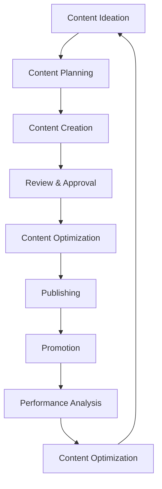

# Marketing Campaign Strategy

## Overview
This document provides comprehensive guidance for implementing marketing campaigns for DafnckMachine v3.1, covering campaign planning, multi-channel marketing strategies, content creation, audience targeting, and performance optimization.

## Campaign Planning Framework

### Strategic Campaign Architecture
```yaml
# Campaign Configuration
campaign_structure:
  awareness:
    objectives:
      - Brand recognition
      - Market education
      - Thought leadership
    channels:
      - Content marketing
      - Social media
      - SEO/SEM
      - PR/Media outreach
    kpis:
      - Brand awareness lift
      - Website traffic
      - Social engagement
      - Share of voice

  consideration:
    objectives:
      - Lead generation
      - Product education
      - Trust building
    channels:
      - Email marketing
      - Webinars
      - Case studies
      - Product demos
    kpis:
      - Lead quality score
      - Email engagement
      - Demo requests
      - Content downloads

  conversion:
    objectives:
      - Trial signups
      - Sales qualified leads
      - Customer acquisition
    channels:
      - Retargeting ads
      - Sales enablement
      - Free trials
      - Personalized outreach
    kpis:
      - Conversion rate
      - Cost per acquisition
      - Trial-to-paid rate
      - Sales velocity

  retention:
    objectives:
      - Customer satisfaction
      - Upselling/cross-selling
      - Advocacy
    channels:
      - Customer success
      - Product updates
      - Community building
      - Referral programs
    kpis:
      - Customer lifetime value
      - Net promoter score
      - Churn rate
      - Referral rate
```

### Campaign Timeline and Milestones
```markdown
# 90-Day Marketing Campaign Roadmap

## Phase 1: Foundation (Days 1-30)
### Week 1-2: Setup and Preparation
- [ ] Campaign infrastructure setup
- [ ] Content calendar creation
- [ ] Asset development initiation
- [ ] Team alignment and training
- [ ] Analytics and tracking implementation

### Week 3-4: Soft Launch
- [ ] Beta content release
- [ ] Initial social media presence
- [ ] Email list building
- [ ] SEO foundation establishment
- [ ] Paid advertising account setup

## Phase 2: Acceleration (Days 31-60)
### Week 5-6: Content Amplification
- [ ] Blog content publication
- [ ] Social media campaign launch
- [ ] Email nurture sequences
- [ ] Influencer outreach
- [ ] PR campaign initiation

### Week 7-8: Paid Acquisition
- [ ] Google Ads campaign launch
- [ ] Social media advertising
- [ ] Retargeting campaigns
- [ ] LinkedIn sponsored content
- [ ] Display advertising

## Phase 3: Optimization (Days 61-90)
### Week 9-10: Performance Analysis
- [ ] Campaign performance review
- [ ] A/B testing implementation
- [ ] Conversion optimization
- [ ] Budget reallocation
- [ ] Strategy refinement

### Week 11-12: Scale and Expand
- [ ] Successful campaign scaling
- [ ] New channel exploration
- [ ] Partnership development
- [ ] Community building
- [ ] Long-term strategy planning
```

## Content Marketing Strategy

### Content Pillars and Themes
```json
{
  "content_pillars": {
    "thought_leadership": {
      "description": "Establishing expertise in AI and automation",
      "content_types": [
        "Industry insights",
        "Technology trends",
        "Best practices",
        "Research reports"
      ],
      "frequency": "2x per week",
      "channels": ["Blog", "LinkedIn", "Medium", "Podcasts"]
    },
    "product_education": {
      "description": "Demonstrating DafnckMachine capabilities",
      "content_types": [
        "Feature tutorials",
        "Use case studies",
        "Demo videos",
        "How-to guides"
      ],
      "frequency": "3x per week",
      "channels": ["YouTube", "Blog", "Email", "Documentation"]
    },
    "customer_success": {
      "description": "Showcasing real-world results",
      "content_types": [
        "Case studies",
        "Customer testimonials",
        "Success metrics",
        "ROI calculations"
      ],
      "frequency": "1x per week",
      "channels": ["Website", "Sales materials", "Social proof"]
    },
    "community_building": {
      "description": "Fostering user engagement and loyalty",
      "content_types": [
        "User-generated content",
        "Community highlights",
        "Expert interviews",
        "Behind-the-scenes"
      ],
      "frequency": "Daily",
      "channels": ["Social media", "Community forums", "Newsletter"]
    }
  }
}
```

### Content Creation Workflow


## Multi-Channel Marketing Strategy

### Digital Marketing Channels
```yaml
# Channel Strategy Configuration
digital_channels:
  search_engine_marketing:
    google_ads:
      campaign_types:
        - Search campaigns
        - Display campaigns
        - Video campaigns
        - Shopping campaigns
      budget_allocation: 40%
      target_keywords:
        - "AI automation platform"
        - "Business process automation"
        - "Workflow optimization"
        - "DafnckMachine alternative"
      
    bing_ads:
      campaign_types:
        - Search campaigns
        - Audience campaigns
      budget_allocation: 10%
      
  social_media_marketing:
    linkedin:
      strategy: "B2B thought leadership"
      content_types:
        - Professional insights
        - Industry news
        - Company updates
        - Employee advocacy
      budget_allocation: 25%
      
    twitter:
      strategy: "Real-time engagement"
      content_types:
        - Quick tips
        - Industry discussions
        - Customer support
        - Live updates
      budget_allocation: 10%
      
    youtube:
      strategy: "Educational content"
      content_types:
        - Product demos
        - Tutorials
        - Webinars
        - Customer stories
      budget_allocation: 15%

  email_marketing:
    segments:
      - Prospects
      - Trial users
      - Customers
      - Advocates
    campaign_types:
      - Welcome series
      - Educational nurture
      - Product updates
      - Re-engagement
    automation_triggers:
      - Signup
      - Trial start
      - Feature usage
      - Inactivity
```

### Traditional Marketing Integration
```markdown
# Traditional Marketing Channels

## Public Relations
- Press release distribution
- Media kit development
- Journalist relationship building
- Industry event participation
- Award submissions

## Event Marketing
- Conference sponsorships
- Trade show participation
- Webinar hosting
- Workshop facilitation
- Networking events

## Partnership Marketing
- Technology integrations
- Reseller partnerships
- Affiliate programs
- Co-marketing agreements
- Industry collaborations

## Direct Marketing
- Account-based marketing
- Personalized outreach
- Sales enablement
- Customer referrals
- Word-of-mouth campaigns
```

## Audience Targeting and Segmentation

### Primary Audience Personas
```json
{
  "personas": {
    "technical_decision_maker": {
      "title": "CTO/VP Engineering",
      "company_size": "50-500 employees",
      "pain_points": [
        "Manual processes slowing development",
        "Integration complexity",
        "Scalability challenges",
        "Resource optimization"
      ],
      "goals": [
        "Automate repetitive tasks",
        "Improve team productivity",
        "Reduce technical debt",
        "Scale efficiently"
      ],
      "preferred_channels": [
        "LinkedIn",
        "Technical blogs",
        "Developer communities",
        "Industry conferences"
      ],
      "content_preferences": [
        "Technical deep-dives",
        "Architecture guides",
        "Performance benchmarks",
        "Integration tutorials"
      ]
    },
    "business_decision_maker": {
      "title": "CEO/COO/VP Operations",
      "company_size": "100-1000 employees",
      "pain_points": [
        "Operational inefficiencies",
        "High operational costs",
        "Slow time-to-market",
        "Competitive pressure"
      ],
      "goals": [
        "Increase operational efficiency",
        "Reduce costs",
        "Accelerate growth",
        "Gain competitive advantage"
      ],
      "preferred_channels": [
        "LinkedIn",
        "Business publications",
        "Executive networks",
        "Industry events"
      ],
      "content_preferences": [
        "ROI case studies",
        "Business impact stories",
        "Industry insights",
        "Executive interviews"
      ]
    },
    "end_user": {
      "title": "Developer/DevOps Engineer",
      "company_size": "Any",
      "pain_points": [
        "Repetitive manual tasks",
        "Complex tool chains",
        "Deployment friction",
        "Monitoring overhead"
      ],
      "goals": [
        "Automate workflows",
        "Simplify processes",
        "Improve reliability",
        "Focus on innovation"
      ],
      "preferred_channels": [
        "GitHub",
        "Stack Overflow",
        "Reddit",
        "YouTube"
      ],
      "content_preferences": [
        "Hands-on tutorials",
        "Code examples",
        "Best practices",
        "Tool comparisons"
      ]
    }
  }
}
```

### Targeting Strategy
```yaml
# Audience Targeting Configuration
targeting_strategy:
  demographic_targeting:
    job_titles:
      - Chief Technology Officer
      - VP of Engineering
      - DevOps Manager
      - Software Architect
      - Product Manager
    
    company_size:
      - 50-200 employees (SMB)
      - 200-1000 employees (Mid-market)
      - 1000+ employees (Enterprise)
    
    industries:
      - Technology
      - Financial Services
      - Healthcare
      - E-commerce
      - Manufacturing
  
  behavioral_targeting:
    website_behavior:
      - Documentation visitors
      - Pricing page viewers
      - Demo requesters
      - Blog readers
      - Feature page visitors
    
    engagement_level:
      - High: Multiple touchpoints
      - Medium: Some engagement
      - Low: Minimal interaction
    
    buying_stage:
      - Awareness: Problem recognition
      - Consideration: Solution evaluation
      - Decision: Vendor selection
      - Retention: Customer success

  psychographic_targeting:
    technology_adoption:
      - Early adopters
      - Mainstream adopters
      - Late adopters
    
    decision_making_style:
      - Data-driven
      - Consensus-building
      - Risk-averse
      - Innovation-focused
```

## Campaign Performance Measurement

### Key Performance Indicators (KPIs)
```yaml
# KPI Framework
kpi_framework:
  awareness_metrics:
    brand_awareness:
      measurement: "Surveys, brand mention tracking"
      target: "25% increase in brand recognition"
      frequency: "Quarterly"
    
    reach:
      measurement: "Social media reach, website traffic"
      target: "1M monthly impressions"
      frequency: "Monthly"
    
    share_of_voice:
      measurement: "Social listening, media monitoring"
      target: "15% share in automation category"
      frequency: "Monthly"

  engagement_metrics:
    social_engagement:
      measurement: "Likes, shares, comments, saves"
      target: "5% average engagement rate"
      frequency: "Weekly"
    
    content_engagement:
      measurement: "Time on page, scroll depth, downloads"
      target: "3+ minutes average session"
      frequency: "Weekly"
    
    email_engagement:
      measurement: "Open rate, click rate, unsubscribe rate"
      target: "25% open rate, 5% click rate"
      frequency: "Per campaign"

  conversion_metrics:
    lead_generation:
      measurement: "Form submissions, demo requests"
      target: "500 qualified leads/month"
      frequency: "Daily"
    
    trial_signups:
      measurement: "Free trial registrations"
      target: "100 trials/month"
      frequency: "Daily"
    
    sales_qualified_leads:
      measurement: "MQL to SQL conversion"
      target: "20% MQL to SQL rate"
      frequency: "Weekly"

  revenue_metrics:
    customer_acquisition_cost:
      measurement: "Total marketing spend / new customers"
      target: "<$500 CAC"
      frequency: "Monthly"
    
    return_on_ad_spend:
      measurement: "Revenue / advertising spend"
      target: "5:1 ROAS"
      frequency: "Monthly"
    
    customer_lifetime_value:
      measurement: "Average revenue per customer"
      target: "$5,000 LTV"
      frequency: "Quarterly"
```

### Analytics and Tracking Setup
```javascript
// Analytics Configuration
const analyticsConfig = {
  googleAnalytics: {
    trackingId: 'GA_TRACKING_ID',
    events: [
      'page_view',
      'demo_request',
      'trial_signup',
      'content_download',
      'video_play',
      'form_submission'
    ],
    customDimensions: {
      userType: 'dimension1',
      trafficSource: 'dimension2',
      campaignId: 'dimension3',
      persona: 'dimension4'
    }
  },
  
  facebookPixel: {
    pixelId: 'FB_PIXEL_ID',
    events: [
      'ViewContent',
      'Lead',
      'CompleteRegistration',
      'InitiateCheckout',
      'Purchase'
    ]
  },
  
  linkedInInsight: {
    partnerId: 'LINKEDIN_PARTNER_ID',
    events: [
      'lead',
      'signup',
      'download'
    ]
  },
  
  customTracking: {
    heatmaps: 'Hotjar',
    sessionRecording: 'FullStory',
    emailTracking: 'Mailchimp',
    socialListening: 'Brandwatch'
  }
};

// UTM Parameter Strategy
const utmStrategy = {
  source: {
    google: 'google',
    facebook: 'facebook',
    linkedin: 'linkedin',
    twitter: 'twitter',
    email: 'email',
    direct: 'direct'
  },
  
  medium: {
    cpc: 'cpc',
    social: 'social',
    email: 'email',
    organic: 'organic',
    referral: 'referral'
  },
  
  campaign: {
    brand: 'brand-awareness',
    product: 'product-education',
    demo: 'demo-campaign',
    trial: 'trial-promotion',
    retargeting: 'retargeting'
  },
  
  content: {
    ad_variant: 'ad-variant-a',
    blog_post: 'blog-post-title',
    email_newsletter: 'newsletter-202501',
    social_post: 'social-post-id'
  }
};
```

## Budget Allocation and ROI Optimization

### Marketing Budget Framework
```yaml
# Annual Marketing Budget Allocation
budget_allocation:
  total_budget: "$500,000"
  
  channels:
    paid_advertising: 
      allocation: 40%
      amount: "$200,000"
      breakdown:
        google_ads: "$120,000"
        linkedin_ads: "$50,000"
        facebook_ads: "$20,000"
        display_ads: "$10,000"
    
    content_marketing:
      allocation: 25%
      amount: "$125,000"
      breakdown:
        content_creation: "$75,000"
        video_production: "$30,000"
        design_assets: "$20,000"
    
    events_pr:
      allocation: 15%
      amount: "$75,000"
      breakdown:
        conferences: "$40,000"
        pr_agency: "$25,000"
        webinars: "$10,000"
    
    marketing_technology:
      allocation: 10%
      amount: "$50,000"
      breakdown:
        marketing_automation: "$25,000"
        analytics_tools: "$15,000"
        design_tools: "$10,000"
    
    team_resources:
      allocation: 10%
      amount: "$50,000"
      breakdown:
        freelancers: "$30,000"
        training: "$10,000"
        agencies: "$10,000"

  quarterly_distribution:
    q1: 20%  # Foundation building
    q2: 30%  # Growth acceleration
    q3: 30%  # Peak performance
    q4: 20%  # Optimization and planning
```

### ROI Optimization Strategies
```markdown
# ROI Optimization Framework

## Performance Monitoring
- Daily budget pacing reviews
- Weekly channel performance analysis
- Monthly ROI assessment
- Quarterly strategy adjustments

## Optimization Tactics
1. **Bid Management**
   - Automated bidding strategies
   - Dayparting optimization
   - Device bid adjustments
   - Geographic targeting refinement

2. **Creative Testing**
   - A/B testing ad creatives
   - Landing page optimization
   - Email subject line testing
   - Call-to-action optimization

3. **Audience Refinement**
   - Lookalike audience creation
   - Negative audience exclusions
   - Behavioral targeting updates
   - Demographic adjustments

4. **Budget Reallocation**
   - Shift budget to high-performing channels
   - Pause underperforming campaigns
   - Increase investment in profitable segments
   - Test new channel opportunities

## Success Metrics
- Cost per acquisition (CPA) reduction
- Return on ad spend (ROAS) improvement
- Conversion rate optimization
- Customer lifetime value increase
```

## Campaign Automation and Workflows

### Marketing Automation Setup
```yaml
# Marketing Automation Workflows
automation_workflows:
  lead_nurturing:
    trigger: "Form submission"
    sequence:
      - day_0: "Welcome email with resources"
      - day_2: "Product overview video"
      - day_5: "Case study and social proof"
      - day_8: "Demo invitation"
      - day_12: "Free trial offer"
      - day_15: "Personal outreach from sales"
    
  trial_onboarding:
    trigger: "Trial signup"
    sequence:
      - day_0: "Welcome and setup guide"
      - day_1: "First feature tutorial"
      - day_3: "Advanced features introduction"
      - day_7: "Success metrics and ROI"
      - day_10: "Upgrade incentive"
      - day_14: "Personal consultation offer"
    
  customer_retention:
    trigger: "Subscription activation"
    sequence:
      - day_0: "Welcome and success resources"
      - day_7: "Feature adoption check"
      - day_30: "Success milestone celebration"
      - day_60: "Advanced training offer"
      - day_90: "Expansion opportunity"
      - day_180: "Renewal preparation"
    
  re_engagement:
    trigger: "30 days inactivity"
    sequence:
      - day_0: "We miss you email"
      - day_3: "New features announcement"
      - day_7: "Success story inspiration"
      - day_10: "Personal check-in"
      - day_14: "Special offer or incentive"
```

### Campaign Management Tools
```json
{
  "marketing_stack": {
    "automation_platform": {
      "primary": "HubSpot",
      "backup": "Marketo",
      "features": [
        "Email automation",
        "Lead scoring",
        "Campaign management",
        "Analytics and reporting"
      ]
    },
    
    "advertising_management": {
      "google_ads": "Google Ads Editor",
      "facebook_ads": "Facebook Ads Manager",
      "linkedin_ads": "LinkedIn Campaign Manager",
      "unified_platform": "Optmyzr"
    },
    
    "content_management": {
      "cms": "WordPress",
      "dam": "Cloudinary",
      "social_scheduling": "Hootsuite",
      "email_design": "Mailchimp"
    },
    
    "analytics_reporting": {
      "web_analytics": "Google Analytics",
      "attribution": "Google Attribution",
      "social_analytics": "Sprout Social",
      "email_analytics": "Mailchimp Insights"
    }
  }
}
```

## Crisis Management and Contingency Planning

### Crisis Response Framework
```markdown
# Marketing Crisis Management Plan

## Crisis Categories
1. **Product Issues**
   - Service outages
   - Security breaches
   - Feature failures
   - Performance problems

2. **Brand Issues**
   - Negative publicity
   - Social media backlash
   - Competitor attacks
   - Industry controversies

3. **Market Issues**
   - Economic downturns
   - Regulatory changes
   - Competitive threats
   - Technology disruptions

## Response Protocols
### Immediate Response (0-2 hours)
- Assess situation severity
- Activate crisis team
- Pause relevant campaigns
- Prepare holding statements

### Short-term Response (2-24 hours)
- Develop response strategy
- Create crisis communications
- Engage with stakeholders
- Monitor sentiment

### Long-term Response (1-30 days)
- Implement recovery plan
- Adjust marketing strategy
- Rebuild brand trust
- Document lessons learned

## Communication Guidelines
- Transparency and honesty
- Timely and consistent messaging
- Empathy and accountability
- Solution-focused approach
```

---

**Last Updated**: 2025-01-27  
**Version**: 1.0  
**Related Documents**: 
- [Social Media Strategy Framework](mdc:01_Machine/04_Documentation/Doc/Phase_6_Outreach_Growth/Social_Media_Strategy_Framework.md)
- [Content Creation Guidelines](mdc:01_Machine/04_Documentation/Doc/Phase_6_Outreach_Growth/Content_Creation_Guidelines.md)
- [Performance Analytics Dashboard](mdc:01_Machine/04_Documentation/Doc/Phase_6_Outreach_Growth/Performance_Analytics_Dashboard.md) 