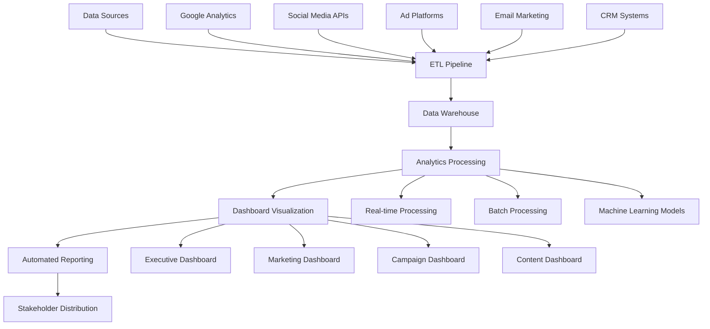

# Performance Analytics Dashboard

## Overview
This document outlines the comprehensive analytics and performance measurement framework for DafnckMachine v3.1 marketing initiatives. It covers dashboard design, KPI tracking, data visualization, reporting automation, and actionable insights generation.

## Analytics Architecture

### Data Collection Framework
```yaml
# Analytics Data Sources
data_sources:
  web_analytics:
    google_analytics:
      tracking_id: "GA4-XXXXXXXXX"
      events_tracked:
        - page_views
        - session_duration
        - bounce_rate
        - conversion_events
        - custom_events
      
    adobe_analytics:
      report_suite: "dafnckmachine-prod"
      custom_variables:
        - user_type
        - traffic_source
        - campaign_id
        - content_category

  marketing_platforms:
    google_ads:
      metrics:
        - impressions
        - clicks
        - conversions
        - cost_per_click
        - quality_score
      
    facebook_ads:
      metrics:
        - reach
        - engagement
        - click_through_rate
        - cost_per_acquisition
        - frequency
      
    linkedin_ads:
      metrics:
        - impressions
        - clicks
        - leads
        - cost_per_lead
        - engagement_rate

  social_media:
    native_analytics:
      - platform_reach
      - engagement_metrics
      - follower_growth
      - content_performance
      - audience_demographics
    
    third_party_tools:
      hootsuite:
        - cross_platform_analytics
        - competitor_analysis
        - sentiment_tracking
        - influencer_metrics

  email_marketing:
    mailchimp:
      metrics:
        - open_rates
        - click_rates
        - unsubscribe_rates
        - list_growth
        - automation_performance
    
    hubspot:
      metrics:
        - email_engagement
        - lead_scoring
        - nurture_sequence_performance
        - contact_lifecycle_stages

  crm_sales:
    salesforce:
      metrics:
        - lead_generation
        - opportunity_creation
        - sales_velocity
        - customer_acquisition_cost
        - lifetime_value
```

### Data Integration Pipeline


## Key Performance Indicators (KPIs)

### Executive Level KPIs
```json
{
  "executive_kpis": {
    "revenue_metrics": {
      "monthly_recurring_revenue": {
        "current_value": "$125,000",
        "target": "$150,000",
        "growth_rate": "15%",
        "trend": "increasing"
      },
      "customer_acquisition_cost": {
        "current_value": "$450",
        "target": "<$500",
        "efficiency": "10% improvement",
        "trend": "decreasing"
      },
      "customer_lifetime_value": {
        "current_value": "$4,800",
        "target": ">$5,000",
        "ratio_to_cac": "10.7:1",
        "trend": "stable"
      }
    },
    
    "growth_metrics": {
      "total_customers": {
        "current_value": "1,250",
        "monthly_growth": "8%",
        "target": "1,500 by Q2",
        "trend": "increasing"
      },
      "market_share": {
        "current_value": "3.2%",
        "target": "5%",
        "competitive_position": "3rd in category",
        "trend": "increasing"
      }
    },
    
    "operational_metrics": {
      "brand_awareness": {
        "aided_awareness": "25%",
        "unaided_awareness": "8%",
        "target": "35% aided by Q3",
        "trend": "increasing"
      },
      "customer_satisfaction": {
        "nps_score": "42",
        "target": ">50",
        "churn_rate": "3.2%",
        "trend": "improving"
      }
    }
  }
}
```

### Marketing Team KPIs
```yaml
# Marketing Performance Metrics
marketing_kpis:
  traffic_metrics:
    website_traffic:
      monthly_visitors: 85000
      target: 100000
      growth_rate: "12%"
      organic_percentage: "65%"
    
    traffic_sources:
      organic_search: "55%"
      paid_search: "20%"
      social_media: "15%"
      direct: "10%"
    
    page_performance:
      average_session_duration: "4:32"
      bounce_rate: "35%"
      pages_per_session: "3.2"
      conversion_rate: "2.8%"

  lead_generation:
    monthly_leads:
      total: 450
      target: 500
      quality_score: "7.2/10"
      cost_per_lead: "$85"
    
    lead_sources:
      content_marketing: "40%"
      paid_advertising: "30%"
      social_media: "20%"
      events_webinars: "10%"
    
    conversion_funnel:
      visitor_to_lead: "2.8%"
      lead_to_opportunity: "25%"
      opportunity_to_customer: "35%"
      overall_conversion: "0.24%"

  content_performance:
    blog_metrics:
      monthly_posts: 16
      average_time_on_page: "5:45"
      social_shares: 1250
      backlinks_generated: 35
    
    video_metrics:
      monthly_views: 25000
      engagement_rate: "8.5%"
      completion_rate: "72%"
      subscriber_growth: "15%"
    
    email_metrics:
      list_size: 12500
      open_rate: "28%"
      click_rate: "6.2%"
      unsubscribe_rate: "0.8%"

  campaign_performance:
    paid_advertising:
      google_ads_roas: "4.2:1"
      facebook_ads_roas: "3.8:1"
      linkedin_ads_roas: "2.9:1"
      overall_roas: "3.7:1"
    
    social_media:
      total_followers: 15750
      engagement_rate: "4.2%"
      reach_growth: "18%"
      mention_sentiment: "78% positive"
```

### Campaign-Specific KPIs
```json
{
  "campaign_kpis": {
    "product_launch_campaign": {
      "campaign_duration": "30 days",
      "budget_allocated": "$50,000",
      "budget_spent": "$47,500",
      "impressions": "2,500,000",
      "clicks": "75,000",
      "conversions": "1,250",
      "conversion_rate": "1.67%",
      "cost_per_conversion": "$38",
      "return_on_ad_spend": "4.2:1"
    },
    
    "brand_awareness_campaign": {
      "campaign_duration": "60 days",
      "budget_allocated": "$75,000",
      "reach": "1,800,000",
      "frequency": "2.3",
      "brand_lift": "15%",
      "aided_awareness_lift": "8%",
      "consideration_lift": "12%",
      "cost_per_thousand_impressions": "$12.50"
    },
    
    "retargeting_campaign": {
      "audience_size": "125,000",
      "impressions": "850,000",
      "clicks": "12,750",
      "click_through_rate": "1.5%",
      "conversions": "425",
      "conversion_rate": "3.33%",
      "cost_per_acquisition": "$95",
      "return_on_ad_spend": "5.8:1"
    }
  }
}
```

## Dashboard Design and Visualization

### Executive Dashboard Layout
```yaml
# Executive Dashboard Configuration
executive_dashboard:
  layout:
    header:
      - company_logo
      - dashboard_title
      - last_updated_timestamp
      - refresh_button
    
    top_row:
      - revenue_summary_card
      - customer_growth_card
      - market_share_card
      - brand_health_card
    
    middle_section:
      - revenue_trend_chart
      - customer_acquisition_funnel
      - marketing_roi_chart
    
    bottom_section:
      - top_performing_campaigns
      - key_insights_panel
      - action_items_list

  visualizations:
    revenue_trend:
      chart_type: "line_chart"
      time_period: "12_months"
      metrics: ["mrr", "arr", "growth_rate"]
      colors: ["#1E40AF", "#10B981", "#F59E0B"]
    
    customer_funnel:
      chart_type: "funnel_chart"
      stages: ["visitors", "leads", "opportunities", "customers"]
      conversion_rates: ["2.8%", "25%", "35%", "100%"]
    
    marketing_roi:
      chart_type: "bar_chart"
      channels: ["paid_search", "social_media", "content", "email"]
      roi_values: [4.2, 3.8, 5.1, 6.3]

  filters:
    time_range:
      - last_7_days
      - last_30_days
      - last_quarter
      - last_year
      - custom_range
    
    segments:
      - all_traffic
      - new_visitors
      - returning_visitors
      - mobile_users
      - desktop_users
```

### Marketing Team Dashboard
```json
{
  "marketing_dashboard": {
    "sections": {
      "traffic_overview": {
        "widgets": [
          {
            "type": "metric_card",
            "title": "Monthly Visitors",
            "value": "85,000",
            "change": "+12%",
            "trend": "up"
          },
          {
            "type": "metric_card",
            "title": "Conversion Rate",
            "value": "2.8%",
            "change": "+0.3%",
            "trend": "up"
          },
          {
            "type": "donut_chart",
            "title": "Traffic Sources",
            "data": {
              "Organic": 55,
              "Paid": 20,
              "Social": 15,
              "Direct": 10
            }
          }
        ]
      },
      
      "campaign_performance": {
        "widgets": [
          {
            "type": "table",
            "title": "Active Campaigns",
            "columns": ["Campaign", "Spend", "Impressions", "Clicks", "Conversions", "ROAS"],
            "data": [
              ["Product Launch", "$15,000", "500K", "12K", "240", "4.2:1"],
              ["Brand Awareness", "$25,000", "1.2M", "8K", "160", "3.8:1"],
              ["Retargeting", "$8,000", "300K", "9K", "180", "5.1:1"]
            ]
          }
        ]
      },
      
      "content_analytics": {
        "widgets": [
          {
            "type": "line_chart",
            "title": "Content Engagement Trends",
            "metrics": ["page_views", "time_on_page", "social_shares"],
            "time_period": "30_days"
          },
          {
            "type": "bar_chart",
            "title": "Top Performing Content",
            "data": {
              "DevOps Best Practices": 15000,
              "Automation Tutorial": 12500,
              "Case Study: TechCorp": 11000,
              "Product Roadmap 2024": 9500
            }
          }
        ]
      }
    }
  }
}
```

### Real-Time Campaign Dashboard
```yaml
# Real-Time Campaign Monitoring
realtime_dashboard:
  auto_refresh: "30_seconds"
  
  alerts:
    performance_alerts:
      - metric: "cost_per_click"
        threshold: ">$5.00"
        action: "email_notification"
      
      - metric: "conversion_rate"
        threshold: "<1.5%"
        action: "slack_notification"
      
      - metric: "daily_budget"
        threshold: ">90%_spent"
        action: "pause_campaign"

  widgets:
    live_metrics:
      - current_spend
      - impressions_today
      - clicks_today
      - conversions_today
      - current_cpc
      - current_ctr
    
    hourly_trends:
      - spend_by_hour
      - clicks_by_hour
      - conversions_by_hour
      - ctr_by_hour
    
    geographic_performance:
      - spend_by_location
      - conversions_by_location
      - cpa_by_location
      - performance_heatmap

  customization:
    user_preferences:
      - default_time_range
      - preferred_metrics
      - alert_settings
      - dashboard_layout
    
    role_based_access:
      - executive_view
      - marketing_manager_view
      - campaign_specialist_view
      - analyst_view
```

## Automated Reporting System

### Report Generation Framework
```yaml
# Automated Reporting Configuration
automated_reporting:
  report_types:
    daily_reports:
      recipients: ["marketing_team@company.com"]
      schedule: "8:00 AM weekdays"
      content:
        - yesterday_performance_summary
        - budget_pacing_alerts
        - top_performing_content
        - conversion_funnel_status
      
    weekly_reports:
      recipients: ["executives@company.com", "marketing_team@company.com"]
      schedule: "Monday 9:00 AM"
      content:
        - week_over_week_performance
        - campaign_performance_summary
        - lead_generation_analysis
        - content_performance_review
        - upcoming_week_forecast
      
    monthly_reports:
      recipients: ["board@company.com", "executives@company.com"]
      schedule: "1st of month 10:00 AM"
      content:
        - monthly_performance_overview
        - goal_achievement_analysis
        - roi_analysis_by_channel
        - competitive_analysis_update
        - next_month_strategy_recommendations

  report_formats:
    executive_summary:
      format: "pdf"
      template: "executive_template.html"
      charts: ["revenue_trend", "customer_growth", "marketing_roi"]
      
    detailed_analysis:
      format: "interactive_html"
      template: "detailed_template.html"
      charts: ["all_performance_charts"]
      data_tables: ["campaign_details", "content_performance"]
      
    data_export:
      format: "csv"
      tables: ["raw_metrics", "calculated_kpis", "attribution_data"]

  distribution:
    email_delivery:
      smtp_server: "smtp.company.com"
      authentication: "oauth2"
      encryption: "tls"
      
    slack_integration:
      webhook_url: "https://hooks.slack.com/services/..."
      channels: ["#marketing", "#executives"]
      message_format: "summary_with_charts"
      
    dashboard_notifications:
      in_app_notifications: true
      push_notifications: true
      notification_preferences: "user_configurable"
```

### Alert and Notification System
```json
{
  "alert_system": {
    "performance_alerts": {
      "budget_overspend": {
        "condition": "daily_spend > daily_budget * 1.1",
        "severity": "high",
        "recipients": ["campaign_manager", "finance_team"],
        "actions": ["email", "slack", "auto_pause_campaign"]
      },
      
      "conversion_drop": {
        "condition": "conversion_rate < historical_average * 0.7",
        "severity": "medium",
        "recipients": ["marketing_team"],
        "actions": ["email", "dashboard_highlight"]
      },
      
      "traffic_spike": {
        "condition": "hourly_traffic > historical_average * 2",
        "severity": "low",
        "recipients": ["marketing_team", "dev_team"],
        "actions": ["slack_notification"]
      }
    },
    
    "opportunity_alerts": {
      "high_performing_content": {
        "condition": "content_engagement > threshold * 1.5",
        "severity": "low",
        "recipients": ["content_team"],
        "actions": ["email", "promotion_suggestion"]
      },
      
      "viral_potential": {
        "condition": "social_shares > viral_threshold",
        "severity": "medium",
        "recipients": ["social_media_team"],
        "actions": ["immediate_notification", "amplification_recommendation"]
      }
    },
    
    "technical_alerts": {
      "data_pipeline_failure": {
        "condition": "data_freshness > 2_hours",
        "severity": "high",
        "recipients": ["data_team", "marketing_ops"],
        "actions": ["immediate_email", "pager_duty"]
      },
      
      "dashboard_downtime": {
        "condition": "dashboard_unavailable",
        "severity": "high",
        "recipients": ["it_team", "marketing_ops"],
        "actions": ["immediate_notification", "backup_dashboard_activation"]
      }
    }
  }
}
```

## Advanced Analytics and Insights

### Attribution Modeling
```yaml
# Attribution Analysis Framework
attribution_modeling:
  models:
    first_touch:
      description: "Credits first interaction with conversion"
      use_case: "Brand awareness campaign evaluation"
      weight_distribution: "100% to first touchpoint"
      
    last_touch:
      description: "Credits last interaction before conversion"
      use_case: "Direct response campaign evaluation"
      weight_distribution: "100% to last touchpoint"
      
    linear:
      description: "Equal credit to all touchpoints"
      use_case: "Full customer journey analysis"
      weight_distribution: "Equal across all touchpoints"
      
    time_decay:
      description: "More credit to recent interactions"
      use_case: "Sales cycle optimization"
      weight_distribution: "Exponential decay over time"
      
    position_based:
      description: "40% first, 40% last, 20% middle"
      use_case: "Balanced attribution analysis"
      weight_distribution: "40-20-40 model"

  implementation:
    data_collection:
      - user_id_tracking
      - session_tracking
      - utm_parameter_capture
      - cross_device_identification
      - offline_conversion_import
      
    analysis_tools:
      - google_analytics_attribution
      - adobe_analytics_attribution
      - custom_attribution_model
      - machine_learning_attribution
      
    reporting:
      - channel_attribution_report
      - campaign_attribution_report
      - content_attribution_report
      - touchpoint_analysis_report

  insights_generation:
    channel_optimization:
      - undervalued_channels_identification
      - budget_reallocation_recommendations
      - channel_synergy_analysis
      - incrementality_testing_suggestions
      
    customer_journey_optimization:
      - journey_bottleneck_identification
      - touchpoint_effectiveness_analysis
      - personalization_opportunities
      - experience_optimization_recommendations
```

### Predictive Analytics
```json
{
  "predictive_analytics": {
    "forecasting_models": {
      "revenue_forecasting": {
        "model_type": "time_series_arima",
        "input_variables": [
          "historical_revenue",
          "marketing_spend",
          "seasonality_factors",
          "economic_indicators"
        ],
        "forecast_horizon": "12_months",
        "confidence_interval": "95%",
        "accuracy_metrics": {
          "mape": "8.5%",
          "rmse": "$12,500",
          "r_squared": "0.92"
        }
      },
      
      "customer_acquisition": {
        "model_type": "regression_ensemble",
        "input_variables": [
          "marketing_spend_by_channel",
          "content_performance_metrics",
          "competitive_activity",
          "market_trends"
        ],
        "forecast_horizon": "3_months",
        "accuracy_metrics": {
          "mape": "12.3%",
          "precision": "0.87",
          "recall": "0.82"
        }
      }
    },
    
    "churn_prediction": {
      "model_type": "gradient_boosting",
      "features": [
        "usage_frequency",
        "feature_adoption",
        "support_tickets",
        "payment_history",
        "engagement_score"
      ],
      "prediction_horizon": "90_days",
      "model_performance": {
        "auc_roc": "0.89",
        "precision": "0.84",
        "recall": "0.78",
        "f1_score": "0.81"
      },
      "actionable_insights": [
        "at_risk_customer_identification",
        "intervention_recommendations",
        "retention_campaign_targeting"
      ]
    },
    
    "lifetime_value_prediction": {
      "model_type": "survival_analysis",
      "features": [
        "initial_purchase_value",
        "onboarding_completion",
        "feature_usage_patterns",
        "support_interactions",
        "demographic_data"
      ],
      "segments": [
        "high_value_customers",
        "growth_potential_customers",
        "at_risk_customers",
        "low_value_customers"
      ],
      "business_applications": [
        "customer_acquisition_budget_allocation",
        "personalized_marketing_campaigns",
        "customer_success_prioritization"
      ]
    }
  }
}
```

### Competitive Intelligence Dashboard
```yaml
# Competitive Analysis Framework
competitive_intelligence:
  competitors:
    primary_competitors:
      - competitor_a:
          name: "AutomationPro"
          market_share: "15%"
          pricing_strategy: "premium"
          key_differentiators: ["enterprise_focus", "advanced_ai"]
      
      - competitor_b:
          name: "WorkflowMaster"
          market_share: "12%"
          pricing_strategy: "value"
          key_differentiators: ["ease_of_use", "quick_setup"]
      
      - competitor_c:
          name: "DevOpsFlow"
          market_share: "8%"
          pricing_strategy: "freemium"
          key_differentiators: ["developer_focused", "open_source"]

  monitoring_metrics:
    digital_presence:
      - website_traffic_estimates
      - search_engine_rankings
      - social_media_followers
      - content_publication_frequency
      - advertising_spend_estimates
      
    product_updates:
      - feature_releases
      - pricing_changes
      - partnership_announcements
      - customer_testimonials
      - case_study_publications
      
    market_positioning:
      - brand_sentiment_analysis
      - share_of_voice_tracking
      - thought_leadership_metrics
      - industry_award_recognition

  data_sources:
    web_analytics:
      - similarweb
      - semrush
      - ahrefs
      - google_trends
      
    social_listening:
      - brandwatch
      - sprout_social
      - hootsuite_insights
      - mention
      
    news_monitoring:
      - google_alerts
      - pr_newswire
      - techcrunch_api
      - industry_publications

  insights_dashboard:
    competitive_positioning:
      - market_share_trends
      - competitive_gap_analysis
      - opportunity_identification
      - threat_assessment
      
    strategic_recommendations:
      - product_development_priorities
      - marketing_message_optimization
      - pricing_strategy_adjustments
      - partnership_opportunities
```

## Data Governance and Quality

### Data Quality Framework
```yaml
# Data Quality Management
data_quality:
  quality_dimensions:
    accuracy:
      definition: "Data correctly represents real-world values"
      measurement: "Validation against source systems"
      target: ">99% accuracy"
      monitoring: "Automated validation rules"
      
    completeness:
      definition: "All required data fields are populated"
      measurement: "Percentage of non-null values"
      target: ">95% completeness"
      monitoring: "Daily completeness reports"
      
    consistency:
      definition: "Data values are consistent across systems"
      measurement: "Cross-system validation checks"
      target: ">98% consistency"
      monitoring: "Real-time consistency monitoring"
      
    timeliness:
      definition: "Data is available when needed"
      measurement: "Data freshness metrics"
      target: "<2 hours latency"
      monitoring: "Data pipeline monitoring"

  validation_rules:
    business_rules:
      - revenue_values_positive: "revenue >= 0"
      - conversion_rate_bounds: "0 <= conversion_rate <= 1"
      - date_range_validity: "date >= campaign_start_date"
      - budget_constraints: "spend <= allocated_budget * 1.1"
      
    technical_rules:
      - data_type_validation: "Ensure correct data types"
      - format_validation: "Validate email, phone, URL formats"
      - referential_integrity: "Foreign key constraints"
      - duplicate_detection: "Identify and flag duplicates"

  monitoring_alerts:
    data_quality_alerts:
      - accuracy_threshold_breach
      - completeness_drop_detected
      - consistency_violation_found
      - timeliness_sla_missed
      
    resolution_procedures:
      - automated_data_correction
      - manual_review_process
      - source_system_investigation
      - stakeholder_notification

  governance_policies:
    data_access:
      - role_based_access_control
      - data_classification_levels
      - audit_trail_requirements
      - privacy_protection_measures
      
    data_retention:
      - retention_period_definitions
      - archival_procedures
      - deletion_policies
      - compliance_requirements
```

### Privacy and Compliance
```json
{
  "privacy_compliance": {
    "gdpr_compliance": {
      "data_processing_basis": [
        "legitimate_interest",
        "consent",
        "contract_performance"
      ],
      "data_subject_rights": [
        "right_to_access",
        "right_to_rectification",
        "right_to_erasure",
        "right_to_portability",
        "right_to_object"
      ],
      "implementation": {
        "consent_management": "OneTrust platform",
        "data_mapping": "Comprehensive data inventory",
        "privacy_by_design": "Built into all systems",
        "dpo_contact": "privacy@company.com"
      }
    },
    
    "ccpa_compliance": {
      "consumer_rights": [
        "right_to_know",
        "right_to_delete",
        "right_to_opt_out",
        "right_to_non_discrimination"
      ],
      "implementation": {
        "privacy_policy_updates": "Annual review",
        "opt_out_mechanisms": "Automated systems",
        "data_sale_disclosure": "No data sales"
      }
    },
    
    "data_security": {
      "encryption": {
        "data_at_rest": "AES-256",
        "data_in_transit": "TLS 1.3",
        "key_management": "AWS KMS"
      },
      "access_controls": {
        "authentication": "Multi-factor required",
        "authorization": "Role-based access",
        "audit_logging": "Comprehensive logs"
      },
      "incident_response": {
        "detection_time": "<1 hour",
        "notification_time": "<24 hours",
        "remediation_time": "<72 hours"
      }
    }
  }
}
```

---

**Last Updated**: 2025-01-27  
**Version**: 1.0  
**Related Documents**: 
- [Marketing Campaign Strategy](mdc:01_Machine/04_Documentation/Doc/Phase_6_Outreach_Growth/Marketing_Campaign_Strategy.md)
- [Social Media Strategy Framework](mdc:01_Machine/04_Documentation/Doc/Phase_6_Outreach_Growth/Social_Media_Strategy_Framework.md)
- [Content Creation Guidelines](mdc:01_Machine/04_Documentation/Doc/Phase_6_Outreach_Growth/Content_Creation_Guidelines.md) 