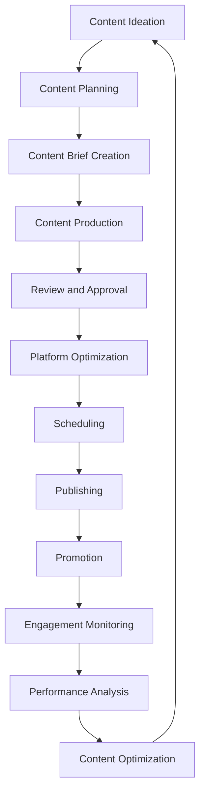
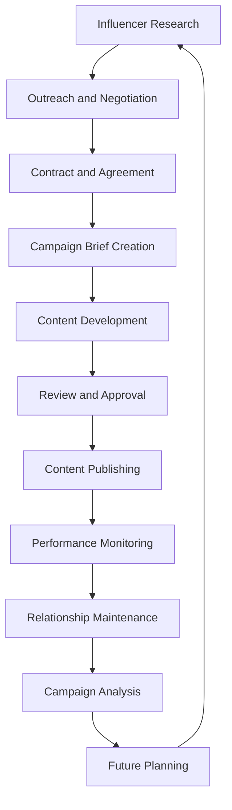

# Social Media Strategy Framework

## Overview
This document outlines the comprehensive social media strategy for DafnckMachine v3.1, covering platform-specific approaches, content strategies, community management, influencer partnerships, and performance optimization across all major social media channels.

## Platform Strategy Matrix

### LinkedIn - B2B Professional Network
```yaml
# LinkedIn Strategy Configuration
linkedin_strategy:
  primary_objectives:
    - Thought leadership establishment
    - B2B lead generation
    - Professional network building
    - Industry authority positioning
  
  target_audience:
    - CTOs and VP Engineering
    - DevOps managers
    - Software architects
    - Business decision makers
    - Technology influencers
  
  content_pillars:
    thought_leadership:
      frequency: "3x per week"
      content_types:
        - Industry insights
        - Technology trends
        - Best practices
        - Opinion pieces
      engagement_tactics:
        - Native video content
        - Carousel posts
        - Document shares
        - Poll engagement
    
    product_education:
      frequency: "2x per week"
      content_types:
        - Feature demonstrations
        - Use case studies
        - Customer success stories
        - Technical tutorials
      engagement_tactics:
        - Live demonstrations
        - Behind-the-scenes content
        - Employee advocacy
        - User-generated content
    
    community_building:
      frequency: "Daily"
      content_types:
        - Industry discussions
        - Comment engagement
        - Share valuable content
        - Network building
      engagement_tactics:
        - Meaningful comments
        - Content amplification
        - Group participation
        - Event promotion

  posting_schedule:
    optimal_times:
      - Tuesday-Thursday: 8-10 AM, 12-2 PM
      - Business hours focus
      - Avoid weekends
    
    content_calendar:
      monday: "Industry insights and trends"
      tuesday: "Product features and demos"
      wednesday: "Customer success stories"
      thursday: "Thought leadership content"
      friday: "Community engagement and networking"

  performance_metrics:
    engagement_rate: ">3%"
    click_through_rate: ">2%"
    lead_generation: "50 qualified leads/month"
    follower_growth: "10% monthly"
    share_rate: ">1%"
```

### Twitter/X - Real-time Engagement
```yaml
# Twitter Strategy Configuration
twitter_strategy:
  primary_objectives:
    - Real-time customer support
    - Industry conversation participation
    - Quick updates and announcements
    - Community engagement
  
  target_audience:
    - Developers and engineers
    - Tech enthusiasts
    - Industry journalists
    - Early adopters
    - Startup community
  
  content_strategy:
    quick_tips:
      frequency: "2x daily"
      character_limit: "280 characters"
      content_types:
        - Development tips
        - Automation hacks
        - Quick tutorials
        - Tool recommendations
    
    real_time_engagement:
      frequency: "Ongoing"
      activities:
        - Reply to mentions
        - Participate in trending topics
        - Share industry news
        - Retweet valuable content
    
    thread_content:
      frequency: "3x per week"
      content_types:
        - Technical deep-dives
        - Step-by-step guides
        - Industry analysis
        - Behind-the-scenes stories

  hashtag_strategy:
    branded_hashtags:
      - "#DafnckMachine"
      - "#AutomationMadeEasy"
      - "#DevOpsSimplified"
    
    industry_hashtags:
      - "#DevOps"
      - "#Automation"
      - "#CI/CD"
      - "#CloudNative"
      - "#TechStack"
    
    trending_hashtags:
      - Monitor daily trends
      - Participate when relevant
      - Create original content
      - Avoid hashtag stuffing

  engagement_tactics:
    twitter_spaces:
      frequency: "Bi-weekly"
      topics:
        - DevOps best practices
        - Automation trends
        - Q&A sessions
        - Industry discussions
    
    twitter_chats:
      participation: "Weekly"
      relevant_chats:
        - "#DevOpsChat"
        - "#TechTalk"
        - "#StartupChat"
        - "#CloudChat"
```

### YouTube - Educational Content Hub
```yaml
# YouTube Strategy Configuration
youtube_strategy:
  primary_objectives:
    - Product education and tutorials
    - Thought leadership through video
    - SEO and organic discovery
    - Long-form content engagement
  
  channel_structure:
    playlists:
      getting_started:
        - "DafnckMachine Overview"
        - "Quick Setup Guide"
        - "First Automation"
        - "Basic Configuration"
      
      advanced_tutorials:
        - "Complex Workflows"
        - "Integration Guides"
        - "Performance Optimization"
        - "Troubleshooting"
      
      case_studies:
        - "Customer Success Stories"
        - "Implementation Examples"
        - "ROI Demonstrations"
        - "Before/After Comparisons"
      
      industry_insights:
        - "DevOps Trends"
        - "Automation Future"
        - "Technology Reviews"
        - "Expert Interviews"

  content_production:
    video_types:
      tutorials:
        length: "5-15 minutes"
        frequency: "2x per week"
        production_style: "Screen recording + voiceover"
        
      demos:
        length: "3-8 minutes"
        frequency: "1x per week"
        production_style: "Live demonstration"
        
      webinars:
        length: "30-60 minutes"
        frequency: "Monthly"
        production_style: "Professional presentation"
        
      interviews:
        length: "20-45 minutes"
        frequency: "Bi-weekly"
        production_style: "Conversational format"

  seo_optimization:
    keyword_strategy:
      primary_keywords:
        - "DevOps automation"
        - "CI/CD pipeline"
        - "Workflow automation"
        - "DafnckMachine tutorial"
      
      long_tail_keywords:
        - "How to automate deployment pipeline"
        - "Best DevOps automation tools"
        - "Setting up CI/CD with DafnckMachine"
        - "Automated testing workflows"
    
    optimization_tactics:
      - Keyword-rich titles
      - Detailed descriptions
      - Custom thumbnails
      - End screen optimization
      - Playlist organization
      - Community tab usage
```

### GitHub - Developer Community
```yaml
# GitHub Strategy Configuration
github_strategy:
  primary_objectives:
    - Open source community building
    - Developer engagement
    - Technical credibility
    - Product integration showcase
  
  repository_strategy:
    main_repository:
      - Comprehensive documentation
      - Regular updates and releases
      - Issue management
      - Community contributions
    
    example_repositories:
      - Integration examples
      - Starter templates
      - Best practice implementations
      - Tutorial code samples
    
    community_repositories:
      - Awesome lists
      - Resource collections
      - Community contributions
      - Third-party integrations

  community_engagement:
    issue_management:
      response_time: "<24 hours"
      categories:
        - Bug reports
        - Feature requests
        - Documentation improvements
        - General questions
    
    pull_request_process:
      review_time: "<48 hours"
      requirements:
        - Code review
        - Testing verification
        - Documentation updates
        - Changelog entries
    
    discussions:
      categories:
        - General Q&A
        - Ideas and feedback
        - Show and tell
        - Announcements

  content_strategy:
    readme_optimization:
      - Clear project description
      - Installation instructions
      - Usage examples
      - Contributing guidelines
      - License information
    
    documentation:
      - API documentation
      - Integration guides
      - Troubleshooting
      - Best practices
      - Migration guides
```

## Content Creation and Curation

### Content Calendar Framework
```json
{
  "monthly_content_themes": {
    "january": {
      "theme": "New Year, New Automations",
      "focus": "Goal setting and optimization",
      "content_types": [
        "Resolution-based automation tips",
        "Year-end performance reviews",
        "Planning content for Q1"
      ]
    },
    "february": {
      "theme": "Love Your Workflow",
      "focus": "Workflow optimization",
      "content_types": [
        "Workflow love stories",
        "Optimization tips",
        "Valentine's Day themed content"
      ]
    },
    "march": {
      "theme": "Spring Cleaning Your Tech Stack",
      "focus": "Technical debt and optimization",
      "content_types": [
        "Code cleanup guides",
        "Performance optimization",
        "Tool consolidation"
      ]
    },
    "april": {
      "theme": "Growth and Scaling",
      "focus": "Scaling automation solutions",
      "content_types": [
        "Scaling strategies",
        "Growth case studies",
        "Enterprise features"
      ]
    }
  },
  
  "weekly_content_structure": {
    "monday": {
      "theme": "Motivation Monday",
      "content_types": [
        "Inspirational success stories",
        "Week ahead previews",
        "Goal-setting content"
      ]
    },
    "tuesday": {
      "theme": "Tutorial Tuesday",
      "content_types": [
        "Step-by-step guides",
        "How-to videos",
        "Technical tutorials"
      ]
    },
    "wednesday": {
      "theme": "Wisdom Wednesday",
      "content_types": [
        "Industry insights",
        "Best practices",
        "Expert opinions"
      ]
    },
    "thursday": {
      "theme": "Throwback Thursday",
      "content_types": [
        "Evolution of automation",
        "Historical perspectives",
        "Progress showcases"
      ]
    },
    "friday": {
      "theme": "Feature Friday",
      "content_types": [
        "Product feature highlights",
        "New release announcements",
        "Feature deep-dives"
      ]
    }
  }
}
```

### Content Creation Workflow


### Visual Content Strategy
```yaml
# Visual Content Guidelines
visual_strategy:
  brand_consistency:
    color_palette:
      primary: "#1E40AF"  # Blue
      secondary: "#10B981"  # Green
      accent: "#F59E0B"  # Orange
      neutral: "#6B7280"  # Gray
    
    typography:
      primary_font: "Inter"
      secondary_font: "JetBrains Mono"
      heading_weights: [600, 700]
      body_weights: [400, 500]
    
    logo_usage:
      - Consistent placement
      - Proper sizing
      - Clear space requirements
      - Color variations

  content_templates:
    social_media_posts:
      - Quote cards
      - Tip graphics
      - Feature announcements
      - Behind-the-scenes
    
    video_content:
      - Intro/outro templates
      - Lower thirds
      - Transition effects
      - Thumbnail designs
    
    infographics:
      - Process flows
      - Statistics presentations
      - Comparison charts
      - Timeline graphics

  photography_guidelines:
    team_photos:
      - Professional headshots
      - Candid work moments
      - Team building events
      - Office environment
    
    product_screenshots:
      - High-resolution captures
      - Consistent UI states
      - Annotated explanations
      - Before/after comparisons
```

## Community Management and Engagement

### Community Management Framework
```yaml
# Community Management Strategy
community_management:
  response_protocols:
    response_times:
      mentions: "<2 hours during business hours"
      direct_messages: "<1 hour during business hours"
      comments: "<4 hours"
      reviews: "<24 hours"
    
    escalation_procedures:
      level_1: "Community manager response"
      level_2: "Product team involvement"
      level_3: "Executive team engagement"
      level_4: "Crisis management protocol"

  engagement_strategies:
    proactive_engagement:
      - Daily mention monitoring
      - Hashtag participation
      - Industry conversation joining
      - Influencer interaction
    
    reactive_engagement:
      - Comment responses
      - Question answering
      - Problem solving
      - Feedback acknowledgment
    
    community_building:
      - User-generated content promotion
      - Community challenges
      - Expert AMAs
      - Virtual events

  tone_and_voice:
    brand_personality:
      - Professional yet approachable
      - Helpful and supportive
      - Technically knowledgeable
      - Innovation-focused
    
    communication_style:
      - Clear and concise
      - Jargon-free when possible
      - Empathetic and understanding
      - Solution-oriented

  crisis_management:
    negative_feedback:
      - Acknowledge quickly
      - Take conversation private when needed
      - Provide solutions
      - Follow up on resolution
    
    technical_issues:
      - Immediate acknowledgment
      - Regular status updates
      - Clear resolution timeline
      - Post-incident communication
```

### User-Generated Content Strategy
```markdown
# User-Generated Content (UGC) Framework

## UGC Campaign Types
1. **Success Story Campaigns**
   - Customer implementation showcases
   - Before/after transformations
   - ROI and impact stories
   - Team testimonials

2. **Challenge Campaigns**
   - Automation challenges
   - Creative implementation contests
   - Best practice sharing
   - Innovation showcases

3. **Educational Content**
   - User tutorials
   - Tips and tricks
   - Problem-solving approaches
   - Integration examples

## UGC Incentive Programs
- Featured content recognition
- Exclusive access to new features
- Speaking opportunities at events
- Co-marketing opportunities
- Monetary rewards for exceptional content

## Content Curation Process
1. **Discovery**: Monitor hashtags, mentions, and submissions
2. **Evaluation**: Assess quality, relevance, and brand alignment
3. **Permission**: Obtain proper usage rights
4. **Enhancement**: Add context, branding, or additional information
5. **Distribution**: Share across appropriate channels
6. **Recognition**: Credit and thank content creators
```

## Influencer Partnership Strategy

### Influencer Identification and Outreach
```yaml
# Influencer Strategy Framework
influencer_strategy:
  influencer_tiers:
    micro_influencers:
      follower_range: "1K-10K"
      focus: "Niche expertise and high engagement"
      compensation: "Product access, exclusive content"
      content_types: "Tutorials, reviews, tips"
    
    mid_tier_influencers:
      follower_range: "10K-100K"
      focus: "Industry thought leaders"
      compensation: "Paid partnerships, event invitations"
      content_types: "Thought leadership, case studies"
    
    macro_influencers:
      follower_range: "100K+"
      focus: "Broad reach and brand awareness"
      compensation: "Significant paid partnerships"
      content_types: "Brand campaigns, major announcements"

  target_influencer_profiles:
    technical_influencers:
      - DevOps practitioners
      - Cloud architects
      - Automation experts
      - Open source contributors
    
    business_influencers:
      - Technology executives
      - Digital transformation leaders
      - Startup founders
      - Industry analysts

  partnership_types:
    content_collaboration:
      - Co-created tutorials
      - Joint webinars
      - Podcast appearances
      - Blog guest posts
    
    product_advocacy:
      - Early access programs
      - Beta testing participation
      - Feature feedback
      - Case study development
    
    event_partnerships:
      - Conference speaking
      - Workshop facilitation
      - Panel participation
      - Networking events

  campaign_measurement:
    reach_metrics:
      - Impressions and views
      - Follower growth
      - Share and save rates
      - Cross-platform amplification
    
    engagement_metrics:
      - Comments and discussions
      - Click-through rates
      - Time spent on content
      - User-generated responses
    
    conversion_metrics:
      - Website traffic from influencer content
      - Trial signups attributed to campaigns
      - Lead generation from partnerships
      - Sales influenced by collaborations
```

### Partnership Management Process


## Social Media Analytics and Optimization

### Performance Measurement Framework
```yaml
# Social Media KPIs
social_media_kpis:
  awareness_metrics:
    reach:
      definition: "Total unique users who saw content"
      target: "1M monthly reach across all platforms"
      measurement: "Platform native analytics"
    
    impressions:
      definition: "Total number of times content was displayed"
      target: "5M monthly impressions"
      measurement: "Platform analytics + third-party tools"
    
    brand_mentions:
      definition: "Organic mentions of brand or product"
      target: "500 monthly mentions"
      measurement: "Social listening tools"

  engagement_metrics:
    engagement_rate:
      definition: "Total engagements / total followers"
      target: ">3% average across platforms"
      measurement: "Platform analytics"
    
    share_rate:
      definition: "Shares / total impressions"
      target: ">1% share rate"
      measurement: "Platform analytics"
    
    comment_sentiment:
      definition: "Positive vs negative comment ratio"
      target: "80% positive sentiment"
      measurement: "Sentiment analysis tools"

  conversion_metrics:
    click_through_rate:
      definition: "Clicks / impressions"
      target: ">2% CTR"
      measurement: "UTM tracking + analytics"
    
    lead_generation:
      definition: "Leads attributed to social media"
      target: "200 monthly social leads"
      measurement: "CRM attribution"
    
    trial_signups:
      definition: "Trial signups from social traffic"
      target: "50 monthly trial signups"
      measurement: "Conversion tracking"

  customer_service_metrics:
    response_time:
      definition: "Average time to respond to inquiries"
      target: "<2 hours during business hours"
      measurement: "Social media management tools"
    
    resolution_rate:
      definition: "Percentage of issues resolved via social"
      target: ">90% resolution rate"
      measurement: "Customer service tracking"
```

### A/B Testing Framework
```json
{
  "ab_testing_strategy": {
    "content_variables": {
      "post_timing": {
        "test_scenarios": [
          "Morning vs afternoon posting",
          "Weekday vs weekend publishing",
          "Business hours vs off-hours"
        ],
        "measurement_period": "4 weeks",
        "success_metrics": ["engagement_rate", "reach", "clicks"]
      },
      
      "content_format": {
        "test_scenarios": [
          "Video vs image posts",
          "Carousel vs single image",
          "Text-heavy vs visual-focused"
        ],
        "measurement_period": "2 weeks",
        "success_metrics": ["engagement_rate", "shares", "saves"]
      },
      
      "call_to_action": {
        "test_scenarios": [
          "Direct vs soft CTAs",
          "Question-based vs statement CTAs",
          "Emoji vs text-only CTAs"
        ],
        "measurement_period": "2 weeks",
        "success_metrics": ["click_through_rate", "conversions"]
      }
    },
    
    "testing_methodology": {
      "sample_size": "Minimum 1000 impressions per variant",
      "confidence_level": "95%",
      "statistical_significance": "Required before declaring winner",
      "documentation": "All tests documented with results and insights"
    }
  }
}
```

### Optimization Strategies
```markdown
# Social Media Optimization Tactics

## Content Optimization
1. **Timing Optimization**
   - Analyze audience activity patterns
   - Test different posting times
   - Use platform-specific optimal times
   - Consider global audience time zones

2. **Format Optimization**
   - Test various content formats
   - Optimize for platform algorithms
   - Use native platform features
   - Adapt content for mobile viewing

3. **Hashtag Optimization**
   - Research trending hashtags
   - Create branded hashtag campaigns
   - Use platform-specific hashtag strategies
   - Monitor hashtag performance

## Engagement Optimization
1. **Community Building**
   - Foster meaningful conversations
   - Respond promptly to comments
   - Create shareable content
   - Encourage user-generated content

2. **Algorithm Optimization**
   - Understand platform algorithms
   - Optimize for engagement signals
   - Use platform-specific features
   - Maintain consistent posting schedule

3. **Cross-Platform Synergy**
   - Adapt content for each platform
   - Cross-promote content strategically
   - Maintain consistent brand voice
   - Leverage platform strengths
```

---

**Last Updated**: 2025-01-27  
**Version**: 1.0  
**Related Documents**: 
- [Marketing Campaign Strategy](mdc:01_Machine/04_Documentation/Doc/Phase_6_Outreach_Growth/Marketing_Campaign_Strategy.md)
- [Content Creation Guidelines](mdc:01_Machine/04_Documentation/Doc/Phase_6_Outreach_Growth/Content_Creation_Guidelines.md)
- [Performance Analytics Dashboard](mdc:01_Machine/04_Documentation/Doc/Phase_6_Outreach_Growth/Performance_Analytics_Dashboard.md) 